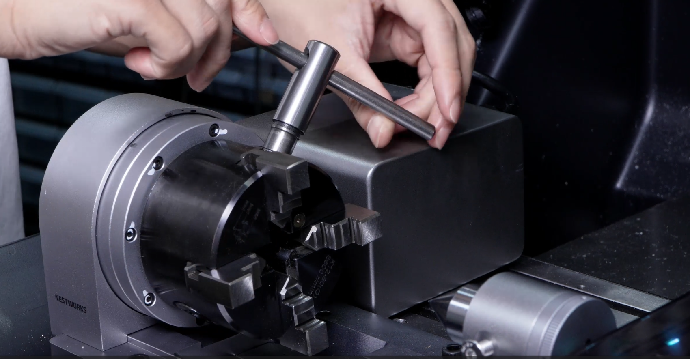
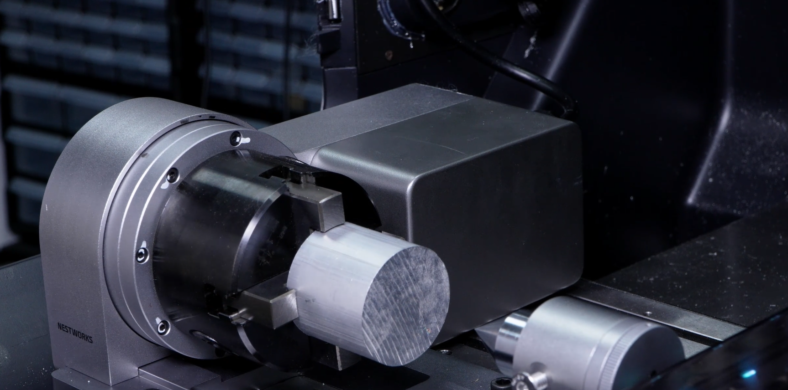
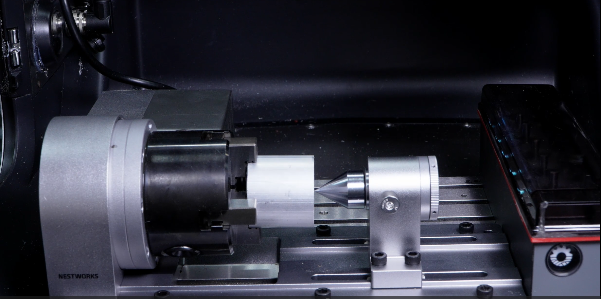

### Workpiece Clamping

1. Use the supplied wrench to loosen the chuck, and place the workpiece blank into the chuck.

{width=12cm}

2. Tighten the chuck with the wrench to securely clamp and fix the workpiece blank.

{width=12cm}

3. After the workpiece blank is secured, install the tailstock center at the opposite end of the workpiece for support, completing the workpiece clamping process.

{width=12cm}

