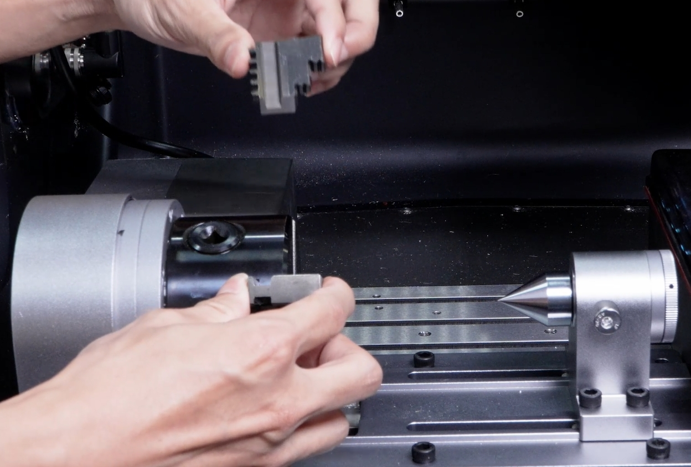
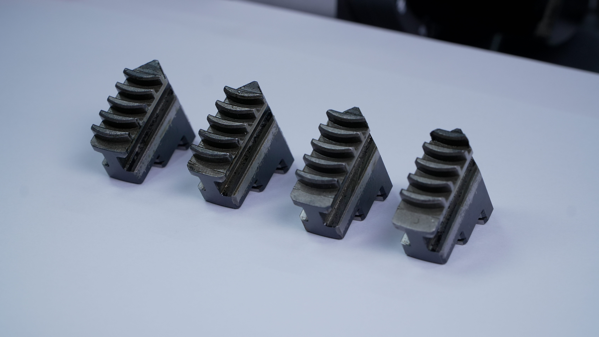
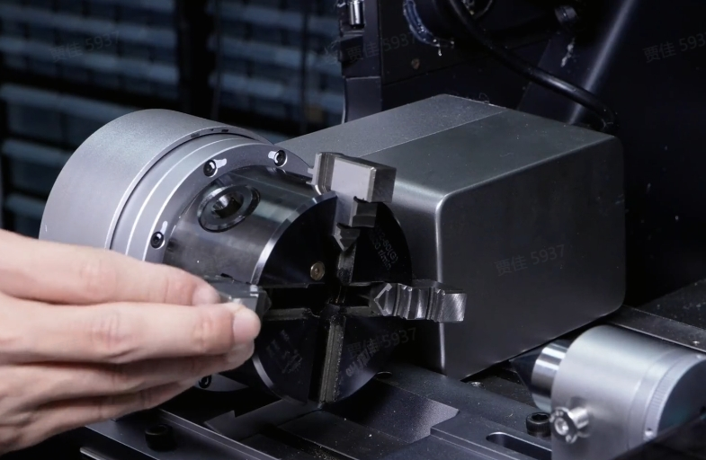
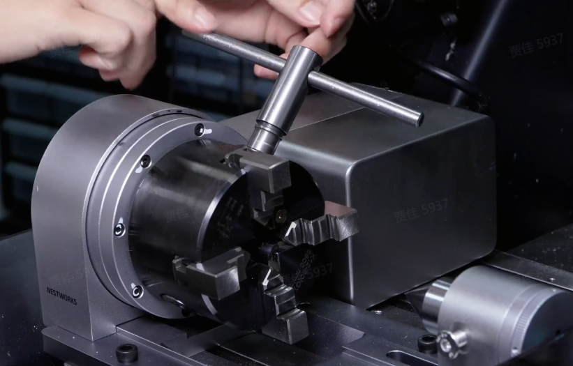

### Reversible Chuck Jaw Replacement

Depending on the workpiece size and clamping method, the standard or reverse jaw segments of the 4th-Axis chuck can be installed as needed. When replacing the jaw segments, strictly follow the numbered sequence during installation.

1. Connect the 4th-Axis to the machine and perform homing, then rotate the jaw segments to a position 45° from horizontal.

2. Disconnect the 4th-Axis from the machine. Use the chuck key to loosen the jaw segments until they are removed from the chuck body, and keep the removed jaw segments together.

{width=10cm}

{width=10cm}

3. Match the jaw segments to be installed with the corresponding numbers (1, 2, 3, 4) in the jaw slots on the chuck body.

{width=10cm}

4. Strictly follow the numerical order from 1 to 4. Use the chuck key to rotate the internal scroll plate so that its first tooth engages with the first tooth of the corresponding numbered jaw segment.

5. Continue tightening with the chuck key until the jaw segments close.

{width=10cm}