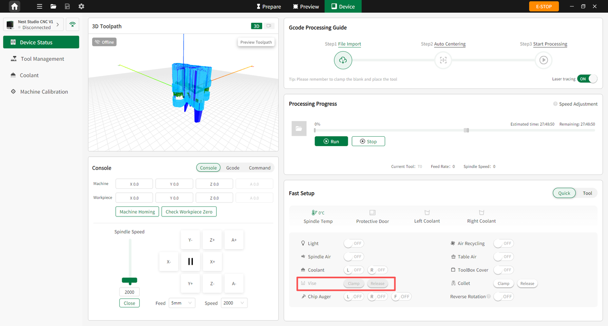

### PC Operation

When the vise is disconnected, the vise icon in the software interface is grayed out and unavailable. After the vise is connected and recognized by the software, users can control it using the Clamp and Release buttons.

{width=12cm}

<!-- mdwb:figure id=9708584d84e4c704 -->
Figure 8-12 PC Operation
<!-- /mdwb:figure -->

