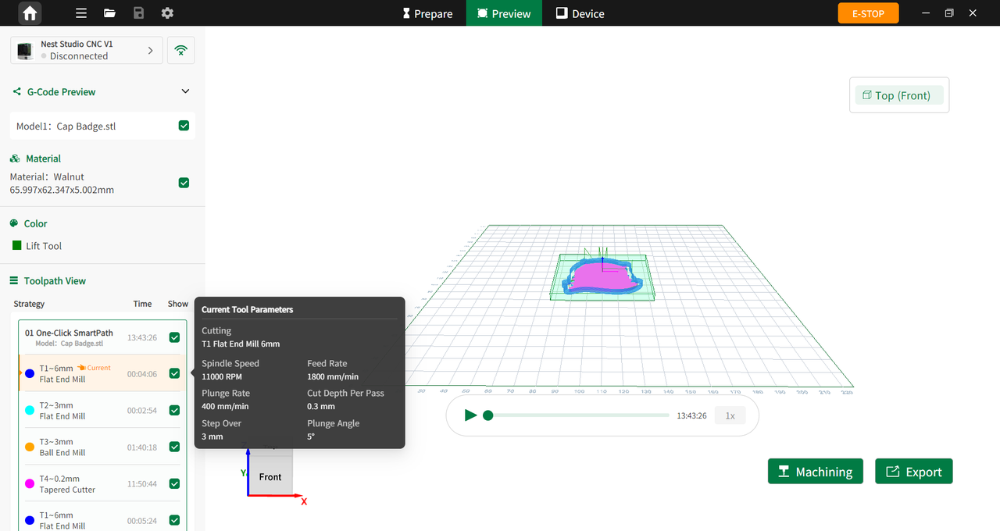

## Toolpath Preview

Users can review the generated G-code information on the preview page, including toolpaths, materials, and tooling information.

{width=12cm}

<!-- mdwb:figure id=c877867a50b6b555 -->
Figure 7-4 Toolpath Preview
<!-- /mdwb:figure -->

> [!note] Notice
> Ensure that the tools and stock material are properly installed and positioned inside the machine before starting machining.

For advanced review or file export, use the following workflows:

- Hover the cursor over a tool card to display a tooltip containing detailed tool information.
- Click **Export** under the second icon in the top toolbar, or click the **Export** button on the page to save the G-code file.

