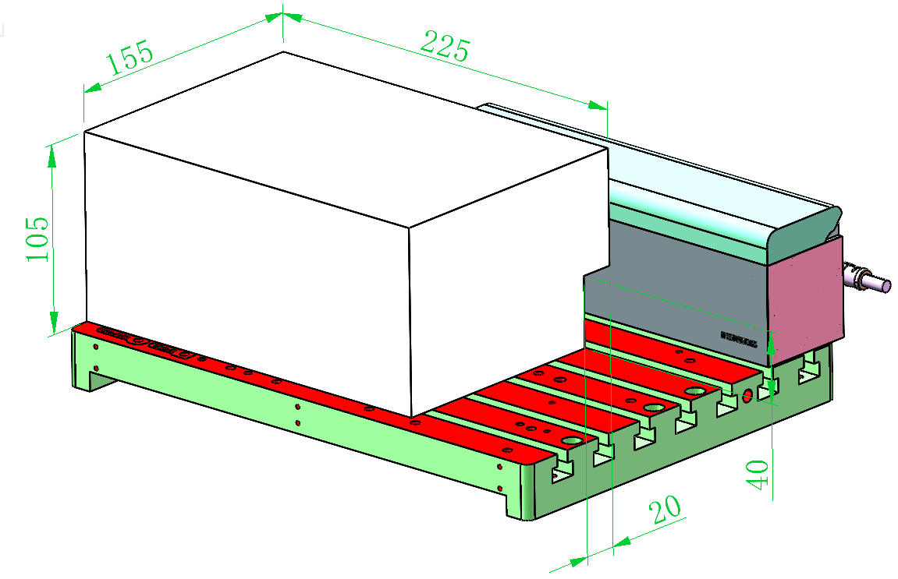

### Rear Tool Magazine

{width=10cm}

<!-- mdwb:figure id=eceacd4588831e60 -->
Figure 2-2 Rear Tool Magazine
<!-- /mdwb:figure -->

The probe safe detection area consists of a 145.5 × 240 × 115 mm detection space, excluding an 18 × 240 × 35 mm non-detection area.