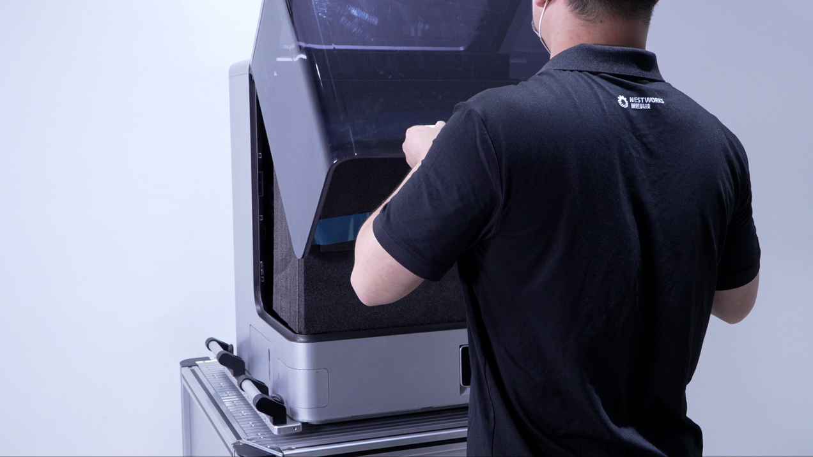
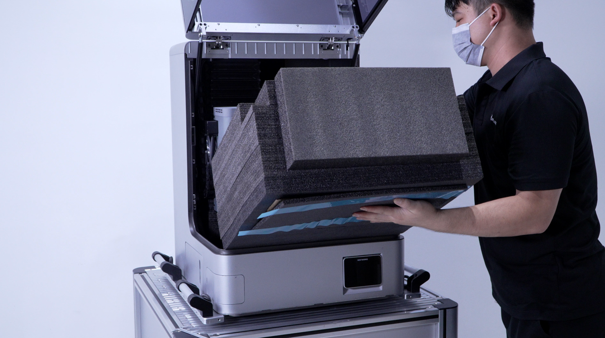
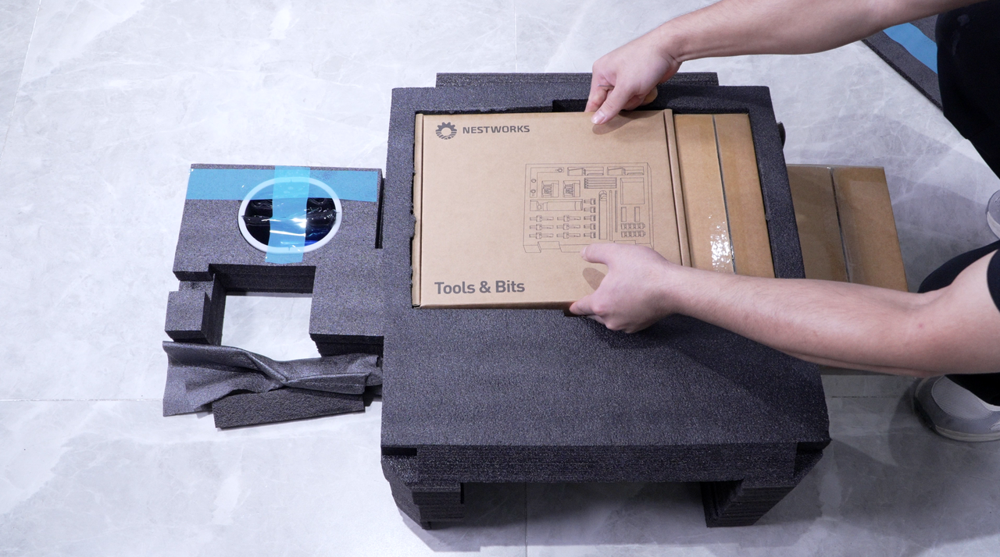
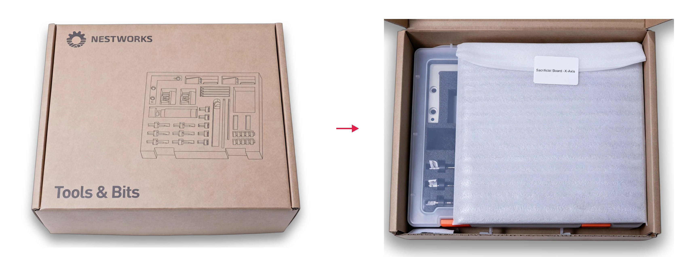
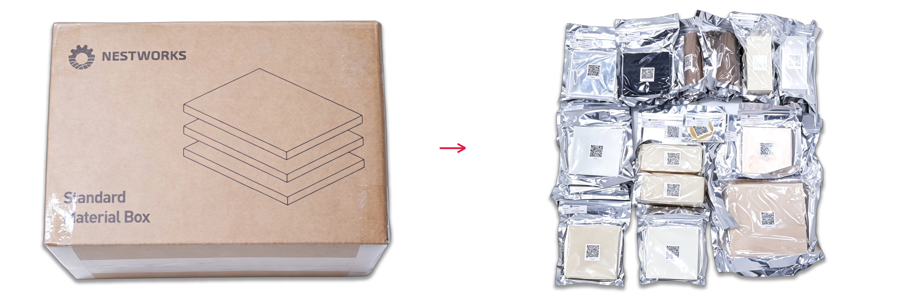
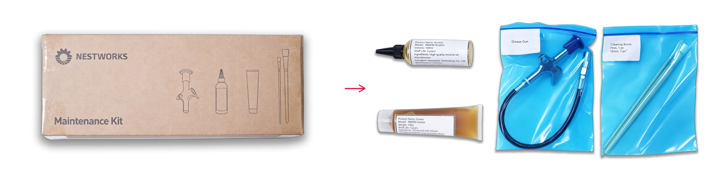
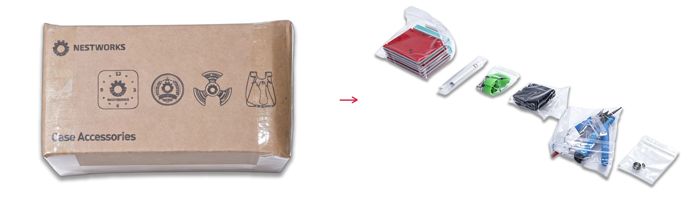
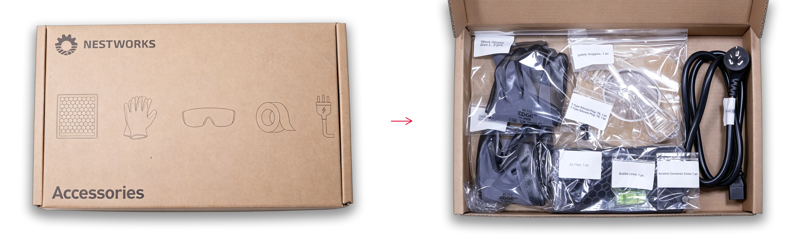

### Check the Accessories

1. After moving the machine to its final operating location, slowly open the acrylic protective door. Check the door for cracks, deformation, looseness, or other abnormalities, and confirm that it opens and closes smoothly.

{width=10cm}

2. Check the machine surface for scratches, dents, paint damage, deformation, or other visible damage. Confirm that the main unit exterior and the initial internal protective condition are intact.

3. After completing the machine appearance inspection, remove the accessories and packaging boxes from inside the machine in order from top to bottom and from outside to inside.

4. Remove the EPE foam block at the front of the machine and the front accessory packaging box.

{width=12cm}

5. Remove the tool kit, standard accessories, maintenance consumables, and other supplied accessories.

{width=12cm}

6. Remove the raw material packaging boxes and related accessories inside the machine and on the worktable.

{width=12cm}

7. Arrange all accessories together and check whether the packaging is damaged, damp, deformed, or abnormal.

8. Check the type and quantity of each accessory and confirm that there are no missing, damaged, or mismatched items.

The supplied accessories are mainly placed in the following packaging boxes. After unpacking, check the contents of each packaging box and confirm that no accessories are missing or damaged.

**Table 3-1 Check the Accessories** <!-- mdwb:table id=b6d4e559af2face0 -->

| Carton Label          | Main Contents                                                                                                                                                                                                                                                                                                                                                                                                                                                                                         |
| --------------------- | ----------------------------------------------------------------------------------------------------------------------------------------------------------------------------------------------------------------------------------------------------------------------------------------------------------------------------------------------------------------------------------------------------------------------------------------------------------------------------------------------------- |
| Tools & Bits          | Basic tool kit (tool box) × 1; longitudinal fixture plate × 1 pc.                                                                                                                                                                                                                                                                                                                                                                                                                                     |
| Accessories           | Power cord × 1 pc.; work gloves × 2 pairs; aviation connector cap for tool magazine × 1 pc.; T-shaped rubber plug (T6) × 1 pc.; double-sided tape × 1 roll; filter element × 1 pc.; safety goggles × 1 pair; spirit level × 1 pc.                                                                                                                                                                                                                                                                     |
| Maintenance Kit       | Grease gun × 1; grease-gun nozzle × 1; grease-gun hose × 1; grease (NW500-Grease) × 1; rust-preventive oil (NW500-RustOil) × 1; brush set × 1.                                                                                                                                                                                                                                                                                                                                                        |
| Case Accessories      | Sanding and polishing kit × 1 set; finishing tool kit × 1 set; wooden clock kit × 1 set; finger spinner kit × 1 set; slingshot kit × 1 set.                                                                                                                                                                                                                                                                                                                                                           |
| Standard Material Box | Brass × 1 (Φ50 × 5 mm); walnut × 2 (Φ40 × 130 mm); beech × 1 (150 × 150 × 25 mm); 6061 aluminum alloy × 3 (100 × 100 × 15 mm); stainless steel × 1 (120 × 50 × 5 mm); acrylic × 1 (100 × 100 × 5 mm); acrylic × 1 (120 × 50 × 50 mm); ABS × 1 (100 × 100 × 10 mm); ABS × 1 (120 × 50 × 50 mm); POM × 1 (100 × 100 × 10 mm); POM × 1 (120 × 50 × 50 mm); modeling board × 1 (100 × 100 × 10 mm); modeling board × 1 (120 × 50 × 50 mm); FR-4 fiberglass copper-clad laminate × 1 (100 × 100 × 1.5 mm). |

**Tools & Bits**

{width=12cm}

<!-- mdwb:figure id=4c15c42d89e3e39e -->
Figure 3-2 Check the Accessories
<!-- /mdwb:figure -->

**Accessories**

{width=12cm}

<!-- mdwb:figure id=741d97761d45c499 -->
Figure 3-3 Check the Accessories
<!-- /mdwb:figure -->

**Maintenance Kit**

{width=12cm}

<!-- mdwb:figure id=0546eea5bb9ceaeb -->
Figure 3-4 Check the Accessories
<!-- /mdwb:figure -->

**Case Accessories**

{width=12cm}

<!-- mdwb:figure id=7a94ba4f8979823b -->
Figure 3-5 Check the Accessories
<!-- /mdwb:figure -->

**Standard Material Box**

{width=12cm}

<!-- mdwb:figure id=89ef616dc8835541 -->
Figure 3-6 Check the Accessories
<!-- /mdwb:figure -->

> [!caution] Caution  
> After unpacking, check whether each packaging box is damaged, cracked, damp, deformed, or abnormal. Confirm that no items inside the box are missing or damaged.
> 
> Keep all packaging materials and accessory boxes before the installation is completed. They may be used for machine transportation, return, replacement, or after-sales service.

