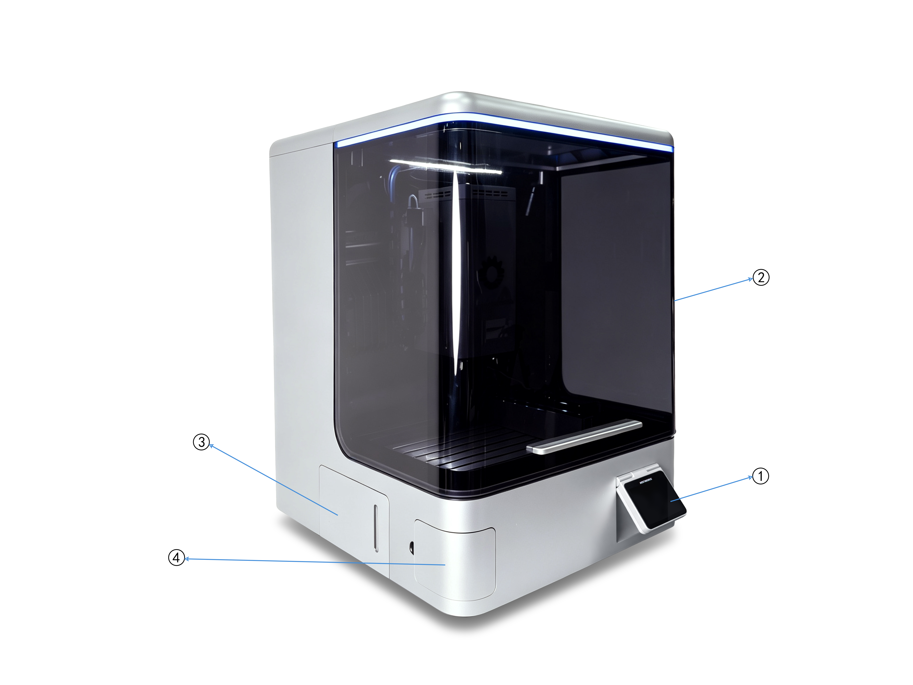
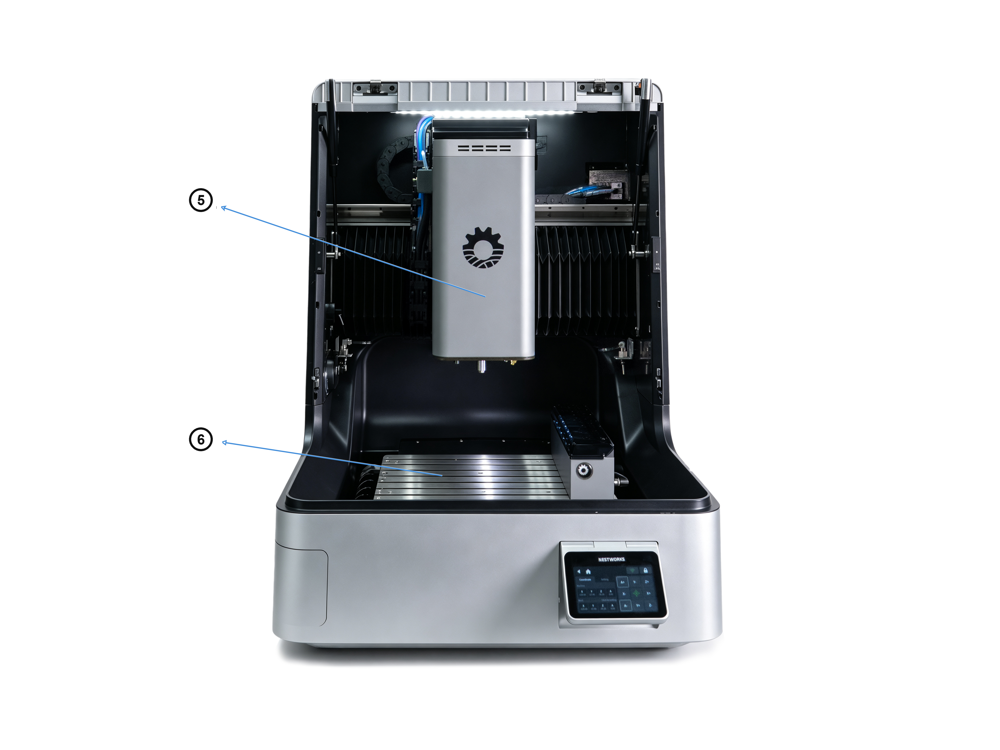

### Key Components

{width=12cm}

<!-- mdwb:figure id=2e99c09d71ac89db -->
Figure 4-1 Key Components
<!-- /mdwb:figure -->

| **No.** | **Component**          | **Description**                                                                                                                                                                                        |
| ------- | ---------------------- | ------------------------------------------------------------------------------------------------------------------------------------------------------------------------------------------------------ |
| 1       | **NestPad**            | The core Human-Machine Interface (HMI) used to display machining parameters, operating status, and alarm information, while enabling program editing and data visualization.                           |
| 2       | **protective door**        | A protective structure designed to isolate the machining area and prevent coolant splashing, chip overflow, and accidental contact; the openable design allows for convenient loading and maintenance. |
| 3       | **Coolant Tank Doors** | Left and right access panels used to cover the coolant tank, maintain fluid cleanliness, and allow for convenient level inspection and tank maintenance.                                               |
| 4       | **Chip Outlet**        | A discharge channel for chips and waste material, used for the centralized removal of machining debris to facilitate cleaning and maintain internal machine cleanliness.                               |

{width=12cm}

<!-- mdwb:figure id=9aad887d395d59b4 -->
Figure 4-2 Key Components
<!-- /mdwb:figure -->

| **No.** | **Component** | **Description**                                                                                                                                                                            |
| ------- | ------------- | ------------------------------------------------------------------------------------------------------------------------------------------------------------------------------------------ |
| 5       | **Spindle**   | The core rotating unit that drives cutting tools at high speeds; it provides essential cutting power and directly determines machining accuracy, rotational speed, and cutting efficiency. |
| 6       | **Worktable** | A platform for workpiece clamping and support; it secures the workpiece and coordinates with the feed system for precise movement and positioning to ensure machining accuracy.            |

