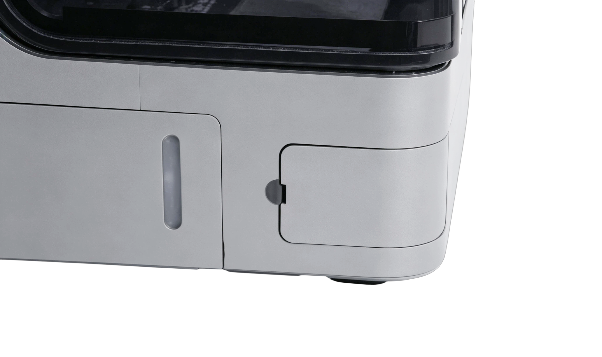
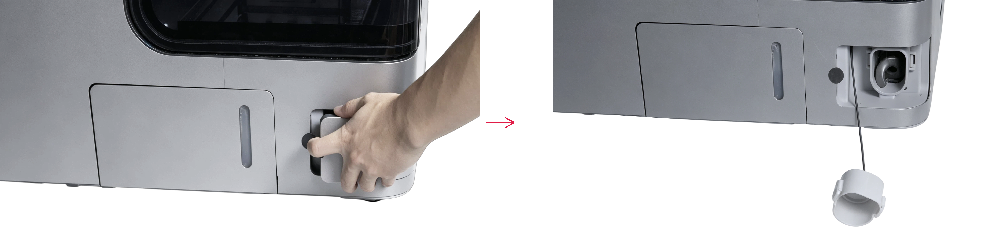
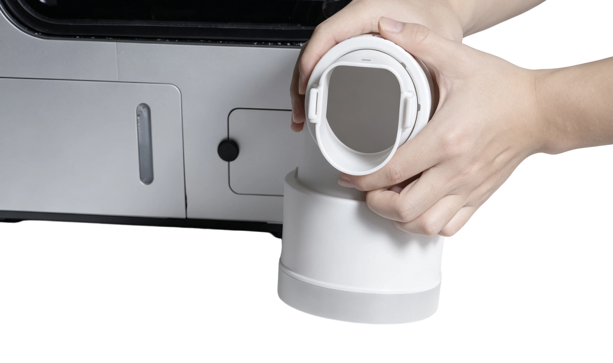
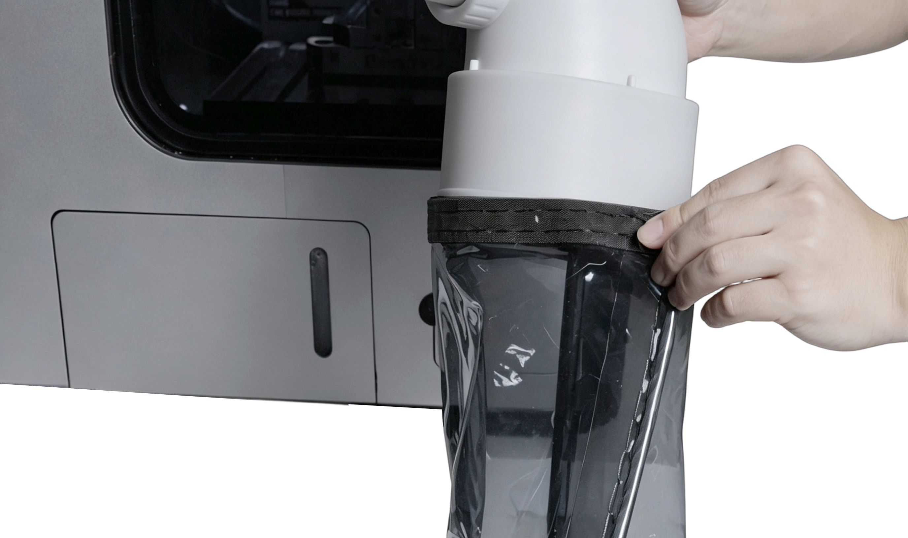
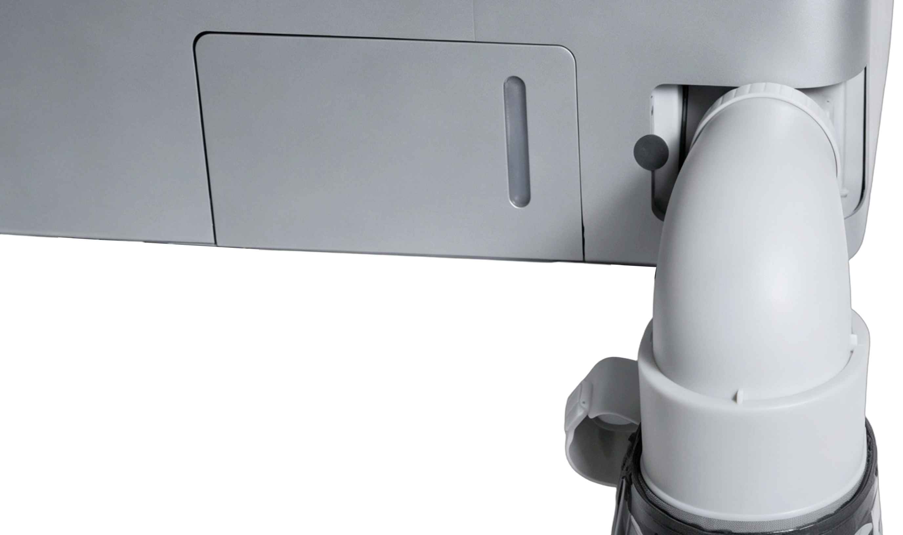
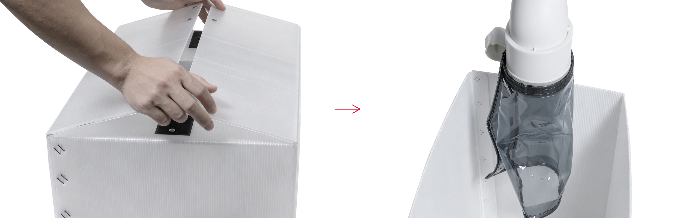

#### Chip Discharge Duct Installation

1. Position the machine at the edge of the workbench on the chip discharge side.

{width=10cm}

2. Remove the magnetic door from the chip discharge outlet. Press and hold the retaining clips on both sides of the outlet cover, and then remove the cover.

{width=12cm}

3. Loosen the nut on the chip discharge duct. Adjust the discharge elbow to the required direction (forward or downward), and install the corresponding flexible rubber discharge hood.

{width=10cm}

4. Insert the chip discharge duct into the chip discharge outlet until the retaining clips lock securely into place.

{width=10cm}

5. Install the chip collection bin and position it underneath the chip discharge duct.

{width=10cm}

6. Secure the fabric dust cover in the appropriate position on the chip discharge duct using the hook-and-loop fastener. The chip discharge duct installation is now complete.

{width=12cm}