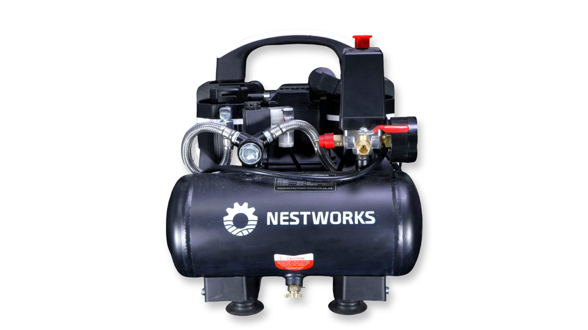
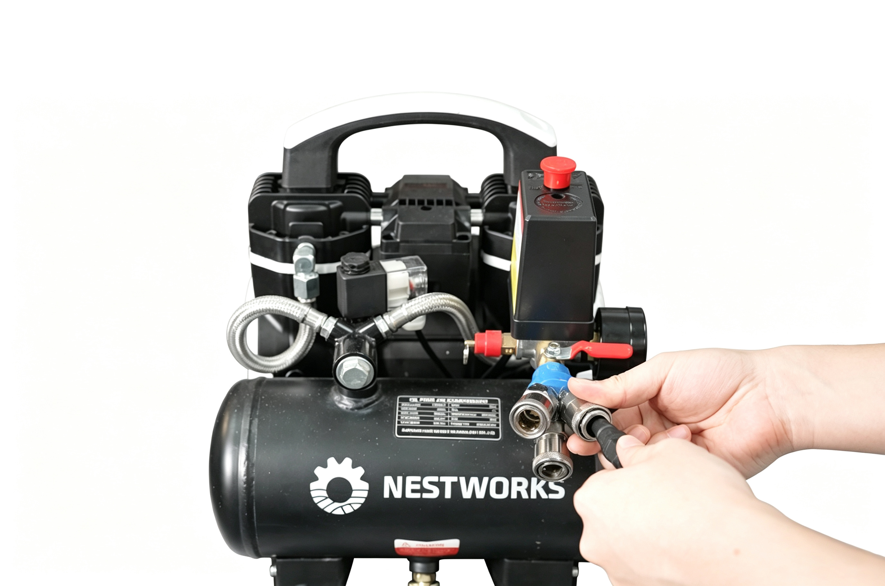

### Connection

1. Place the air compressor on a stable and well-ventilated surface, ensuring it is away from water sources, high-temperature areas, and flammable or explosive materials.  

{width=12cm}

2. Connect the air outlet of the air compressor to the machine air interface using the air hose, and ensure all connections are secure and free from air leakage.  

{width=12cm}

