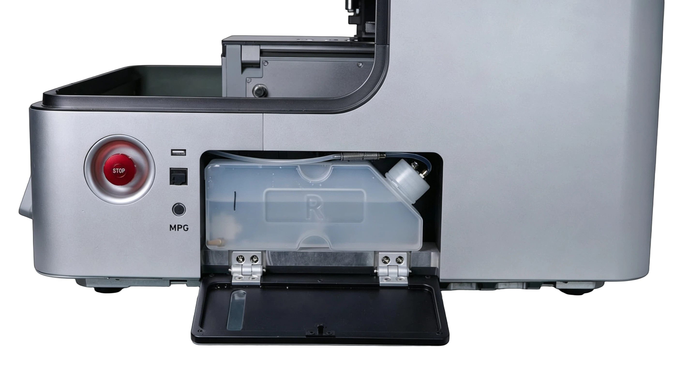
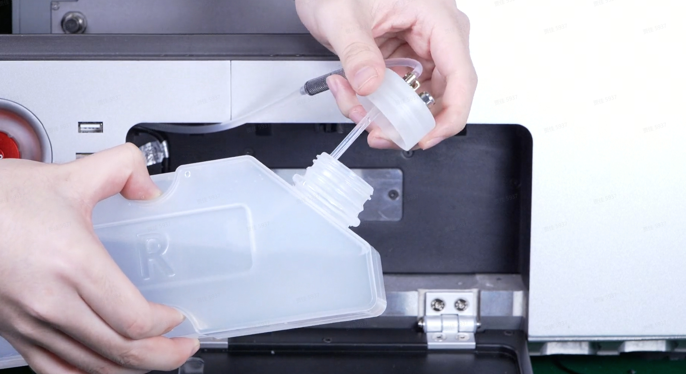

### Installation and Filling

1. Place the water tank in the designated position at the bottom of the equipment, align it with the mounting interface, and gently push it into place. Ensure the magnetic pad securely attaches to the outer casing, and that the water tank is stable and level.  

{width=12cm}

2. Open the water tank filling port and add purified water or dedicated coolant. For metal machining, dedicated coolant is recommended. Keep the liquid level within the marked range on the water tank, without exceeding the maximum level or falling below the minimum level. 

{width=12cm}

3. After filling, tighten the filling port cover, ensure the vent valve is positioned upward, and confirm the copper filter is submerged below the liquid level to prevent leakage.

