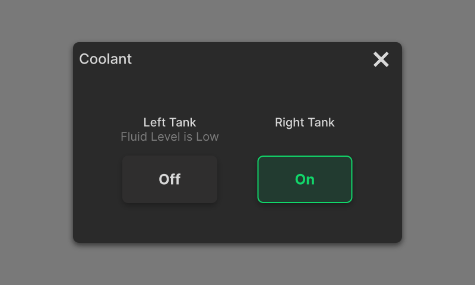

### Settings and Adjustment

1. After powering on the machine, enter the spray control interface in the control system and click **On**. Confirm that coolant is discharged normally from the spray head and covers the machining area.  

{width=12cm}

2. Based on machining requirements, adjust the spray flow using the manual adjustment valve on the water inlet pipe behind the spindle. When facing the machine, rotate the valve clockwise to increase the flow and counterclockwise to decrease the flow.  
3. After machining is complete, click **Stop Spray** to stop the spray function, and then turn off the power.

