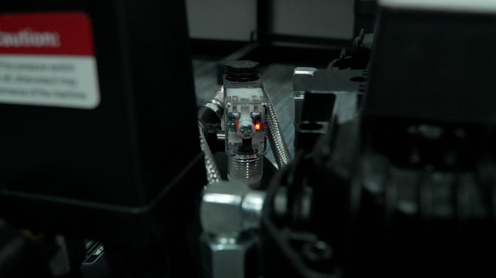

### Powering

- Startup: Press the power switch on the front of the air compressor. The indicator light will turn on, and the compressor will start running and inflating. Once the preset pressure is reached, the compressor will stop automatically and restart when the pressure drops below the specified range.  

{width=12cm}

<!-- mdwb:figure id=e476f9efde24ad69 -->
Figure 8-10 Powering
<!-- /mdwb:figure -->

- Shutdown: After processing is complete, close the air path switch on the equipment, turn off the air compressor power switch, and then disconnect the power plug.

