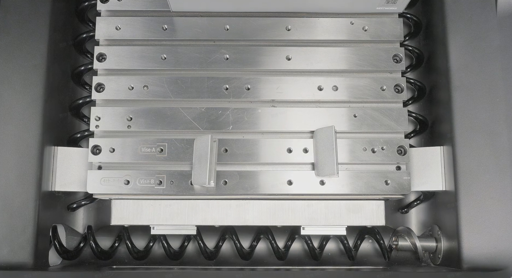
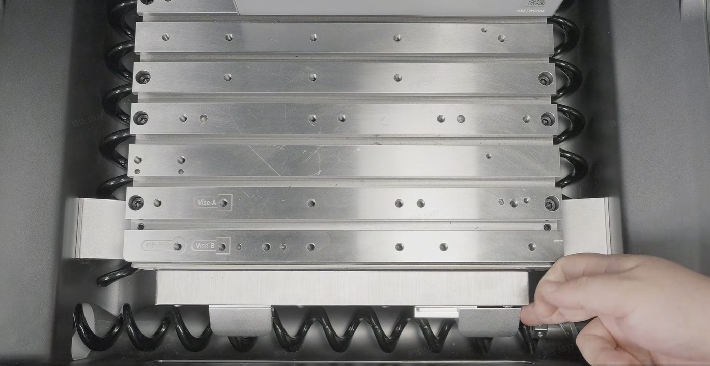

#### Front Chip Auger Installation

1. Remove the chip discharge outlet. Insert the front collecting auger through the chip discharge outlet of the machine, and insert the front collecting auger into the motor shaft until the threaded end of the motor shaft protrudes from the end of the auger shaft.

{width=12cm}

2. Use the front auger nut to tighten the threaded end of the motor shaft and secure the front collecting auger, completing the installation of the front chip auger.

{width=12cm}

3. Install the left, right, and front auger limit blocks. Close the protective door, start auger rotation, and observe the auger rotation status.

{width=12cm}