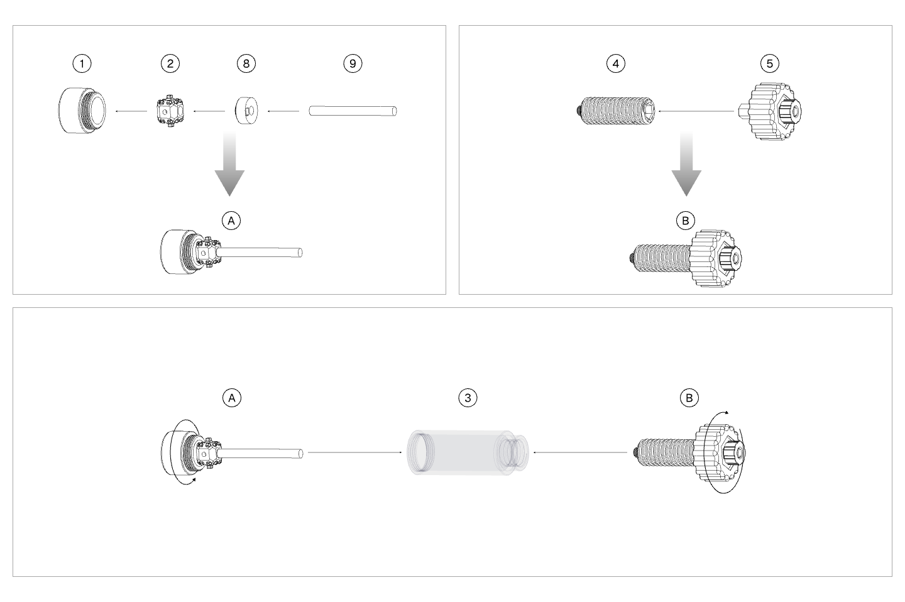

#### Milling Cutter Installation

{width=12cm}

<!-- mdwb:figure id=12c4a9c170561df1 -->
Figure 4-9 Milling Cutter Installation
<!-- /mdwb:figure -->

1. Unscrew the front cover, and install the tool sleeve, milling cutter retainer, and milling cutter in sequence.

2. Pull the knurled cap outward. Quickly remove the knurled cap and screw rod inside the tube, then reassemble them outside the tube.

3. Reinstall the front cover, and turn the knurled cap clockwise until the screw rod is fully pushed to complete tool installation.