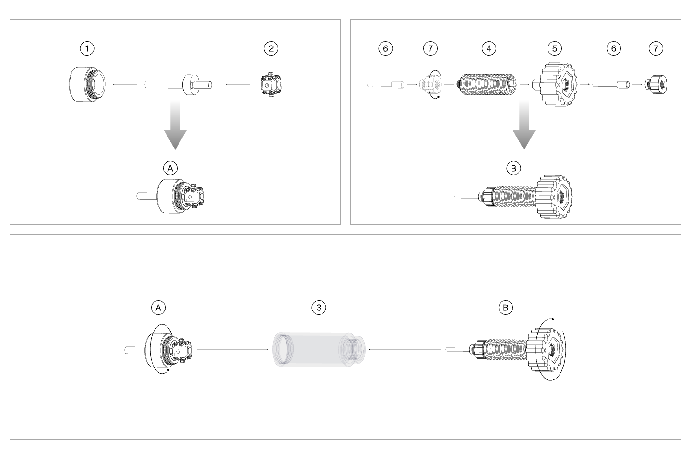

####  Milling Cutter Removal

{width=12cm}

<!-- mdwb:figure id=834c2c97a0c379b1 -->
Figure 4-10 Milling Cutter Removal
<!-- /mdwb:figure -->

1. Unscrew the front cover, and install the tool sleeve with the milling cutter and the milling cutter retainer in sequence.

2. Pull the knurled cap outward. Quickly remove the knurled cap and screw rod inside the tube, then reassemble them outside the tube.

3. Remove the pin and pin holder behind the knurled cap, and install them in front of the screw rod.

4. Reinstall the front cover and screw rod into the tube. Turn the knurled cap clockwise until the milling cutter is successfully removed.