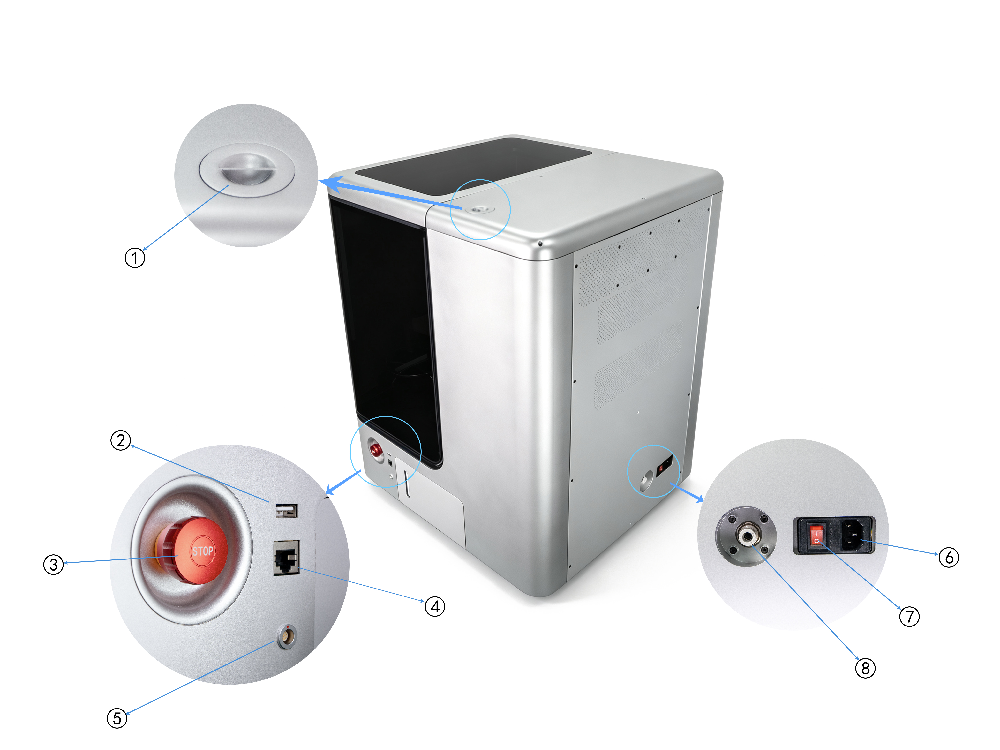
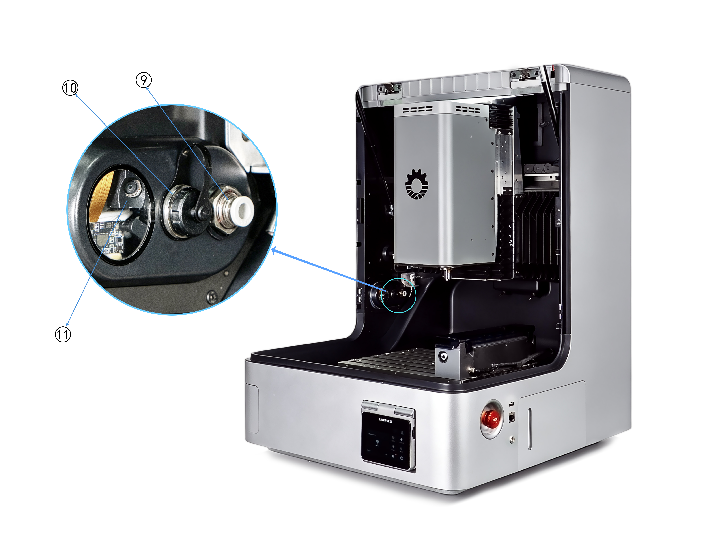
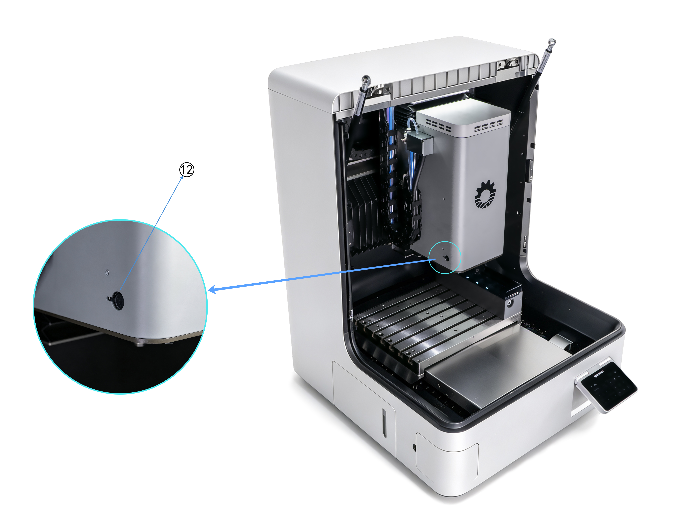
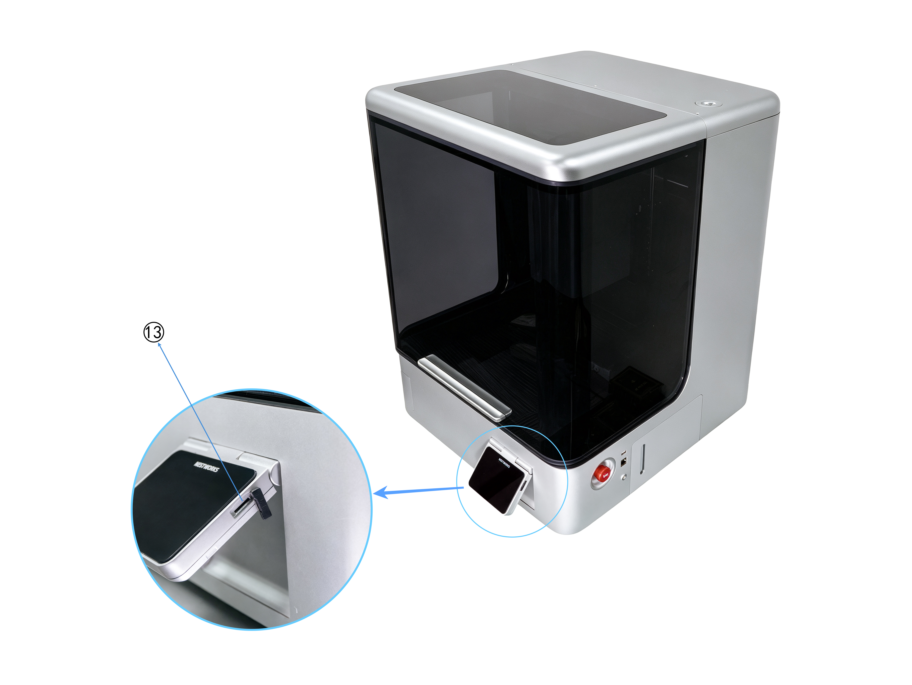

### External Ports

{width=12cm}

<!-- mdwb:figure id=993c040079c2723c -->
Figure 4-3 External Ports
<!-- /mdwb:figure -->

| **No.** | **Interface**            | **Functional Description**                                                                                                                                    |
| ------- | ------------------------ | ------------------------------------------------------------------------------------------------------------------------------------------------------------- |
| 1       | **Vacuum Port**          | Connects to an external vacuum or dust collector to extract dust and chips generated during machining, maintaining internal cleanliness and preventing clogs. |
| 2       | **USB Port**             | Used for importing/exporting machining programs, updating system firmware, and backing up machine parameters for data exchange and system upgrades.           |
| 3       | **E-Stop Button**        | Instantly cuts off machine power in emergencies to stop all moving parts immediately, ensuring personnel and machine safety.                              |
| 4       | **RJ45 (Ethernet)**      | Used for network connectivity to enable remote monitoring, program transfer, machine management, and data acquisition.                                         |
| 5       | **MPG Port**             | Connects an external handwheel for manual fine-tuning of the worktable or spindle position for tool setting, alignment, and parameter debugging.              |
| 6       | **Power Inlet**          | Main power input port; must be connected to a power cable that meets the machine's rated specifications to power the entire machine.                        |
| 7       | **Power Switch**         | Controls the main power supply for turning the machine on or off.                                                                                             |
| 8       | **Air Inlet (External)** | Main compressed air input for the pneumatic system. Requires a stable air source with compliant pressure (Rated: 0.6 MPa, Max: 0.8 MPa).                      |

{width=12cm}

<!-- mdwb:figure id=a6497f67d1c2761c -->
Figure 4-4 External Ports
<!-- /mdwb:figure -->

| **No.** | **Interface**                    | **Functional Description**                                                                                                                                                                                                                            |
| ------- | -------------------------------- | ----------------------------------------------------------------------------------------------------------------------------------------------------------------------------------------------------------------------------------------------------- |
| 9       | **Air Port (Machining Area)**    | Provides compressed air for spindle air blast, tool cleaning, or pneumatic fixtures to ensure machining stability and cleanliness.                                                                                                                    |
| 10      | **4th-Axis Port**                | Connects an external 4th-Axis rotary table for workpiece indexing or continuous multi-sided machining, expanding the machine's machining capabilities and process range. It can also connect to an external vise to provide more workholding options. |
| 11      | **Right-Side Monitoring Camera** | Monitors the machining process in real time to help prevent machining accidents.                                                                                                                                                                      |

{width=12cm}

<!-- mdwb:figure id=2bbbc3cb0b3b4dcc -->
Figure 4-5 External Ports
<!-- /mdwb:figure -->

| **No.** | **Interface**  | **Functional Description**                                                                                                                           |
| ------- | -------------- | ---------------------------------------------------------------------------------------------------------------------------------------------------- |
| 12      | **Laser Port** | A reserved expansion port for external laser modules, supporting laser marking, engraving, and positioning functions to enrich processing scenarios. |

{width=12cm}

<!-- mdwb:figure id=3ea8b50c26a1575f -->
Figure 4-6 External Ports
<!-- /mdwb:figure -->

| **No.** | **Interface**    | **Functional Description**                                                                                                                                                              |
| ------- | ---------------- | --------------------------------------------------------------------------------------------------------------------------------------------------------------------------------------- |
| 13      | **TF Card Slot** | Located on the side of the touchscreen; used for importing/exporting machining programs, updating system firmware, and backing up machine parameters or logs for offline data exchange. |

