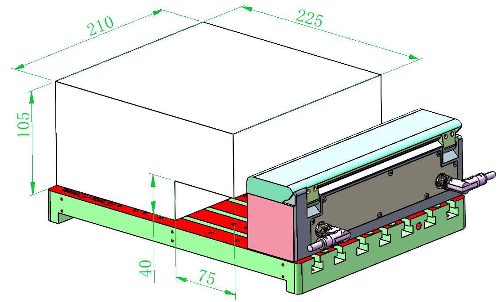

### Right-side Tool Magazine

{width=10cm}

<!-- mdwb:figure id=d21ed678ef8b6e90 -->
Figure 2-1 Right-side Tool Magazine
<!-- /mdwb:figure -->

The probe safe detection area consists of a 177 × 210 × 115 mm detection space, excluding a 38 × 210 × 18 mm non-detection area.
