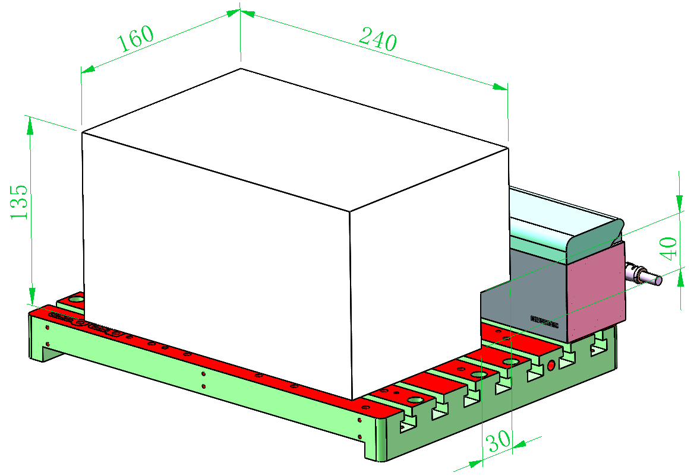
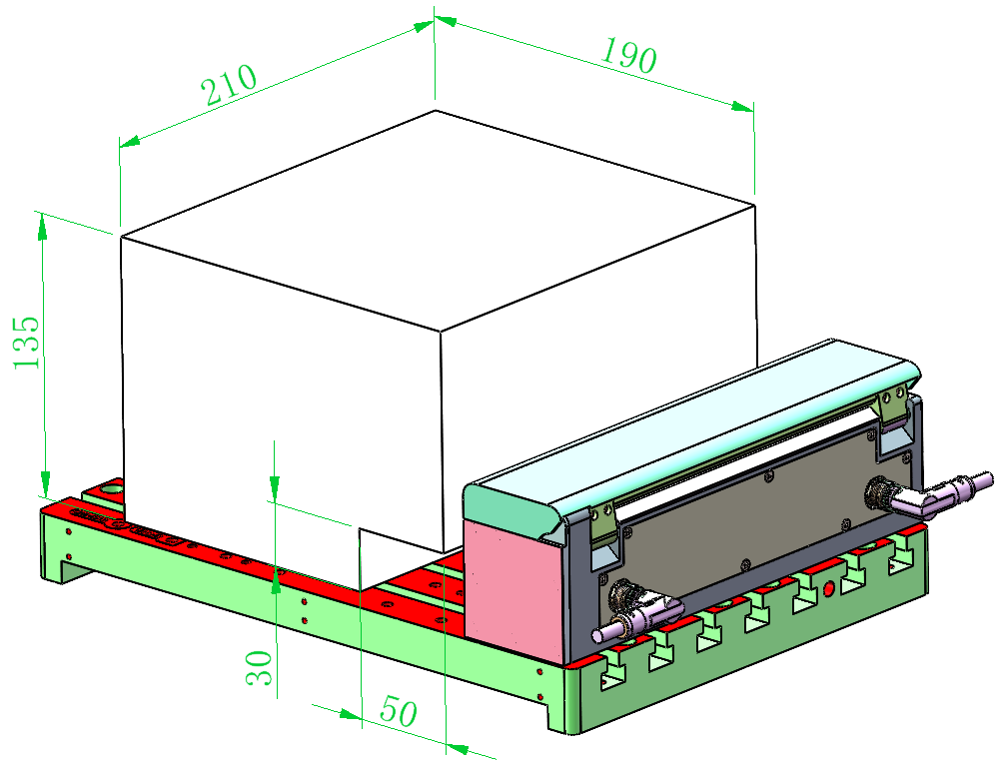
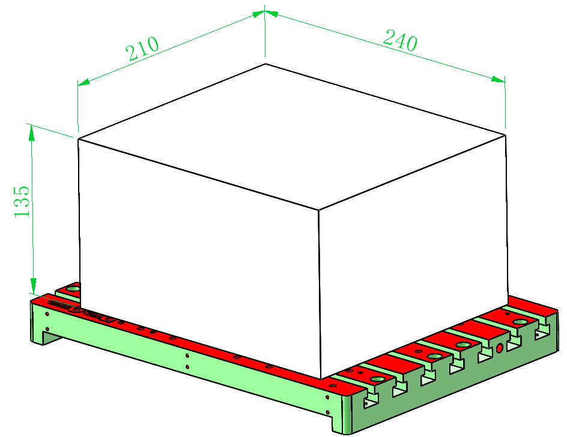

### 3-Axis Machining Dimensions

1. Tool magazine on the X-axis right side

    {width=8cm}

<!-- mdwb:figure id=9d298c3408f23342 -->
Figure 9-1 3-Axis Machining Dimensions
<!-- /mdwb:figure -->

2. Tool magazine on the Y-axis inner side  

{width=8cm}

<!-- mdwb:figure id=d45e8427fedf2906 -->
Figure 9-2 3-Axis Machining Dimensions
<!-- /mdwb:figure -->

3. Tool magazine removed

{width=8cm}

<!-- mdwb:figure id=e1a464143000ed42 -->
Figure 9-3 3-Axis Machining Dimensions
<!-- /mdwb:figure -->

