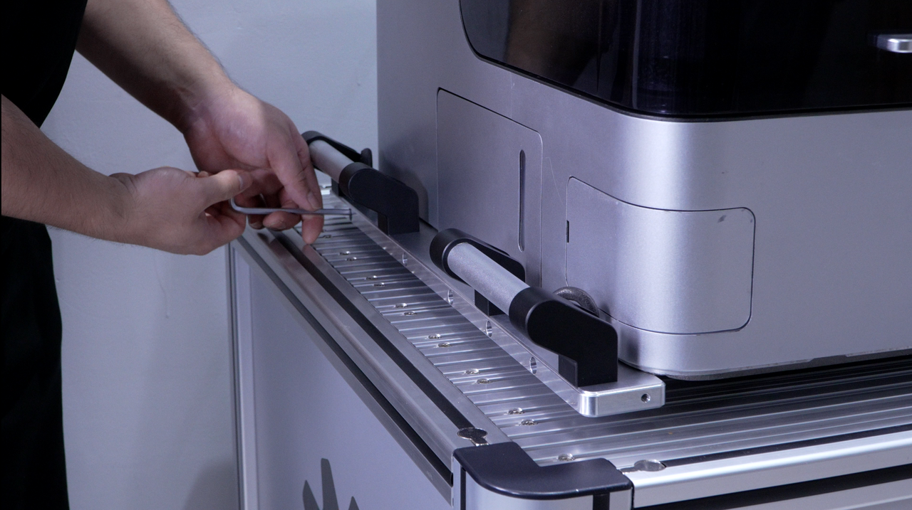

#### Remove the Main Unit Transport Handles

Remove the main unit transport handles after the machine has been moved and all other transport restraints and protective materials have been removed. Use the appropriate tools and follow standard procedures during removal. Do not use excessive force. Store all removed screws and components properly.

1. Use a suitable tool to remove the fixing screws from the transport handles on both sides of the machine, then remove the transport handles.

{width=12cm}

2. Store the removed handles and fixing screws properly.

