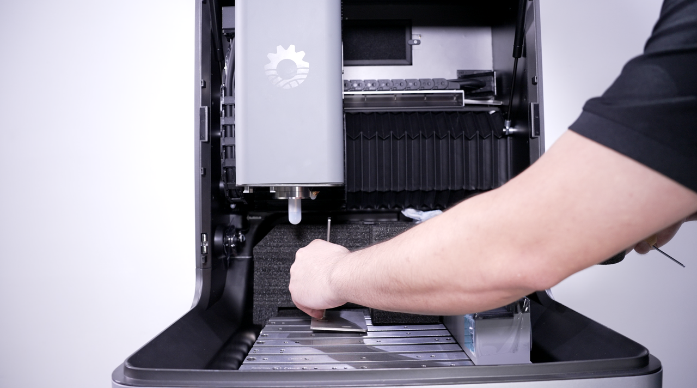
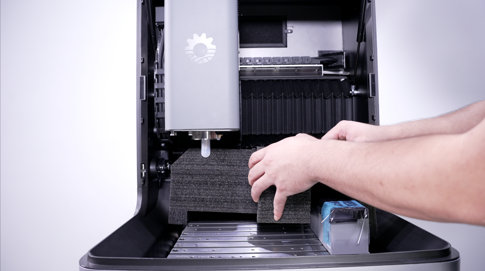
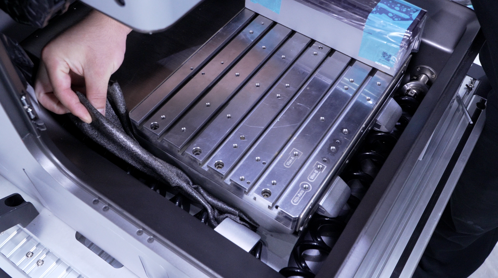
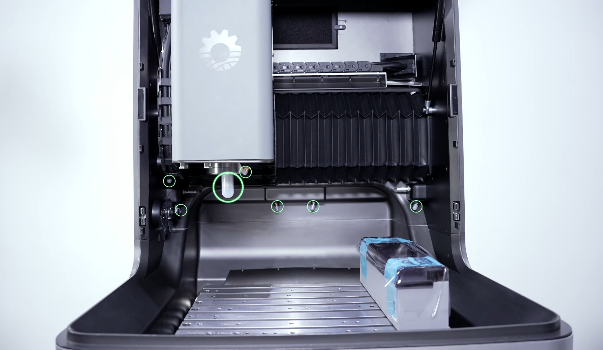
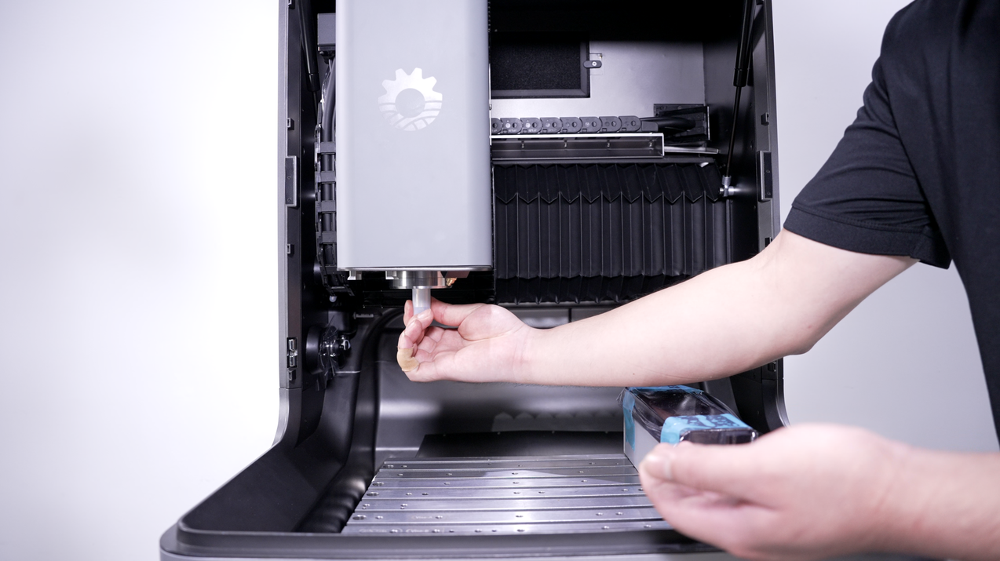
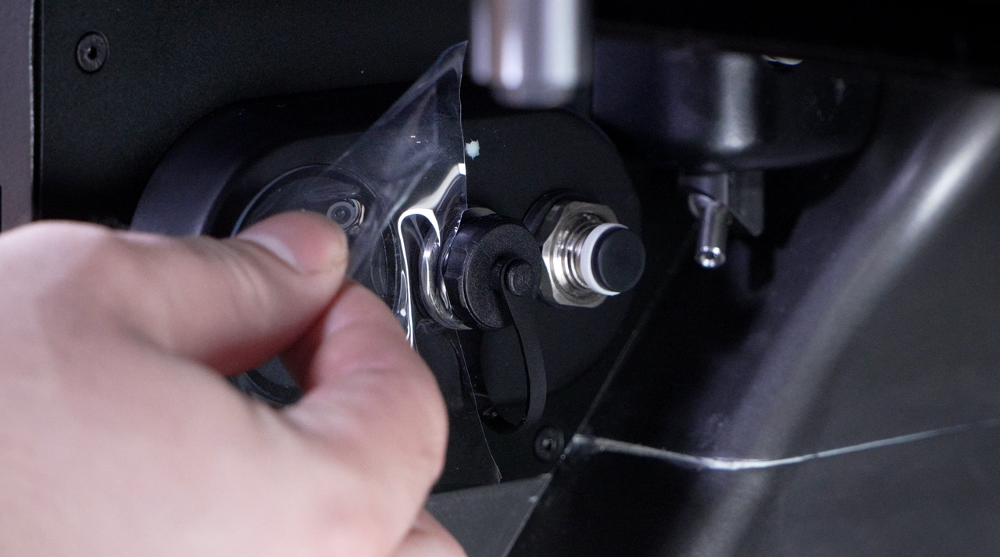
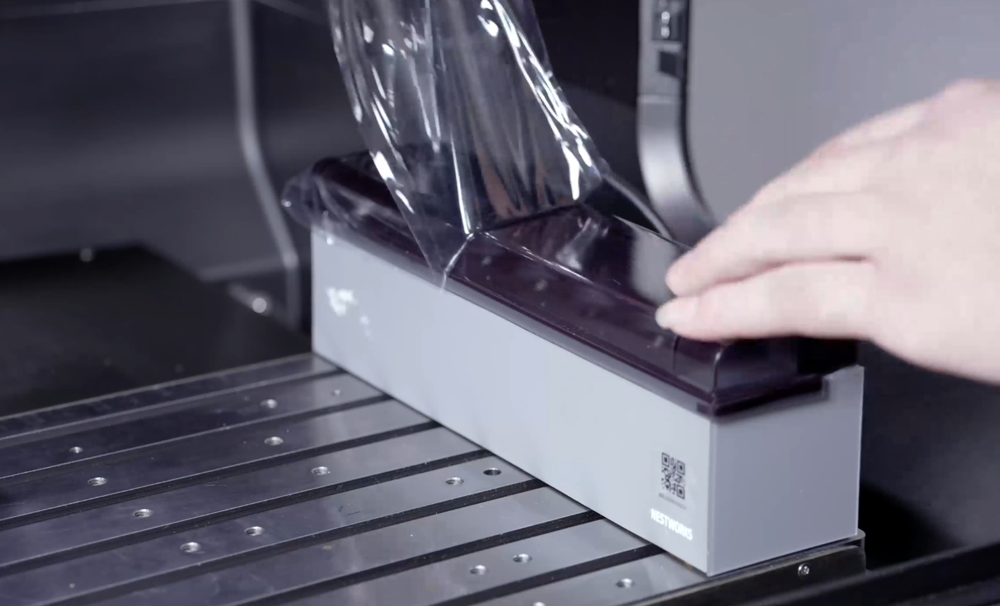
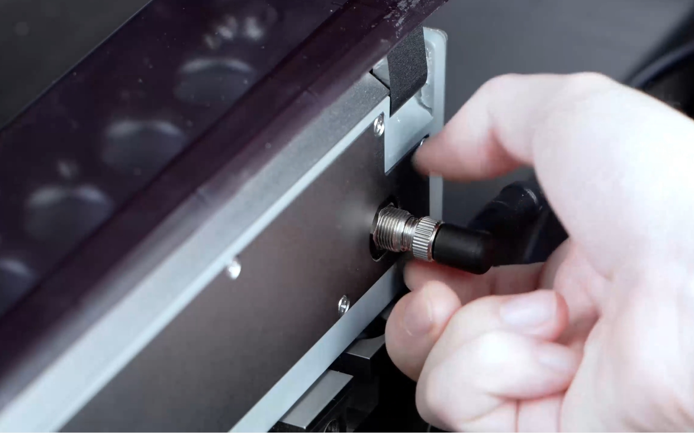

#### Remove Internal Transport Protective Materials

1. Remove the protective pads from the worktable and any remaining transport protective materials from inside the machine.

{width=10cm}

2. Remove the protective EPE foam from the rear of the machine and around the bellows cover, then take out the included chip removal accessories.

{width=10cm}

3. Remove the EPE foam and other cushioning materials from the outside of the chip removal assembly.

{width=10cm}

4. Remove the protective covers from the internal air nozzle, spindle air nozzle, and spindle tool-clamping position.

{width=10cm}

{width=10cm}

5. Remove the protective films or stickers from the camera, lighting assembly, probe, protective door, and other components.

{width=10cm}

6. Remove the securing tape and protective film from the tool magazine.

{width=10cm}

7. Remove the cable connector from its transport securing position and move it behind the tool magazine.

{width=10cm}

8. Remove any remaining packaging materials, tape, and other transport-related materials from inside the machine.

> [!caution] Caution
> When removing transport protective materials, avoid direct contact between sharp tools and the machine surface to prevent scratches or damage to related components.

