# Fixture Kit User Guide

This fixture kit is primarily used to secure and clamp thin, lightweight workpieces, such as small sheets or hardware components, ensuring that they do not loosen or shift during engraving.

## Accessory List

The fixture kit includes the following accessories:

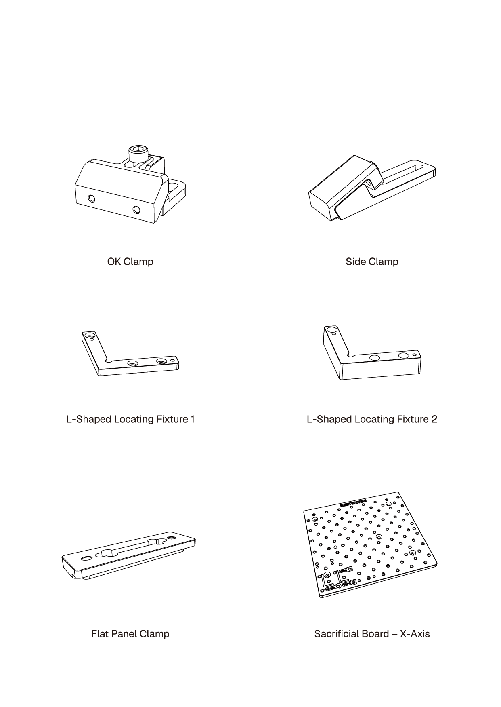{width=12cm}

The included fasteners and tools are shown below:

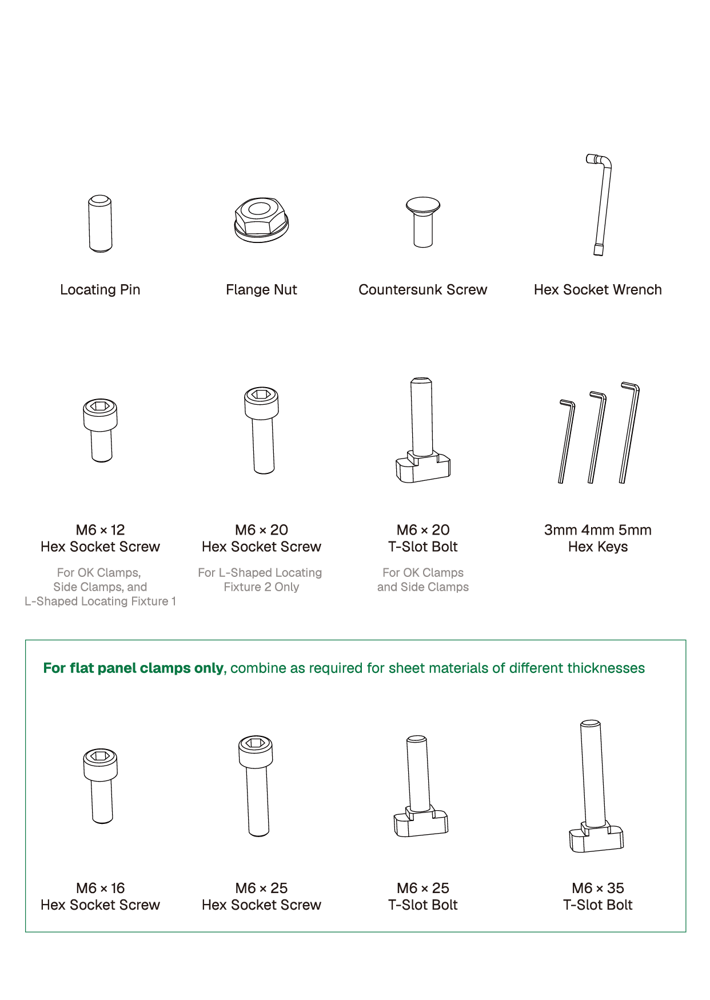{width=12cm}

## Materials

The fixture kit can be used for:

- Oversized square stock that is difficult to clamp in a vise.
- Thin sheet materials, such as PCBs, metal sheets, and wood panels.

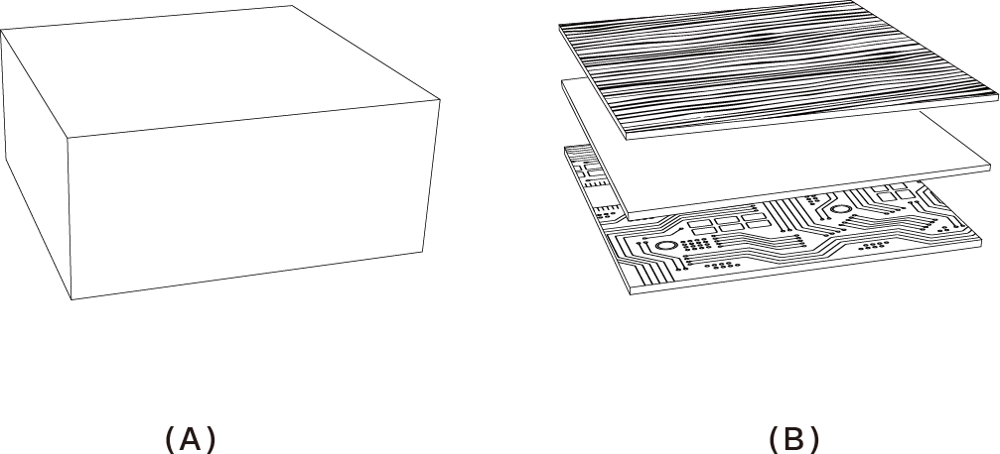{width=12cm}

Select a clamping method based on the stock dimensions and machining load:

| Clamping Method | Recommended Application |
| --- | --- |
| L-shaped locating fixture and OK clamps | Stock with consistent dimensions; applications requiring quick loading and unloading and relatively low machining loads |
| L-shaped locating fixture and side clamps | Smaller stock; applications requiring quick loading and unloading and relatively low machining loads |
| Flat panel clamps | Larger stock and applications involving relatively high machining loads |

## Centering

Centering is an important step that allows the machine to determine the dimensions of the stock. When selecting and clamping the material, make sure to leave enough space for the probe to take measurements.

### When Using the L-Shaped Locating Fixture

- If the lower-left corner is set as the workpiece origin, only the Z-axis height needs to be measured.
- If the center of the workpiece is set as the origin, the X-, Y-, and Z-axis positions must be measured.

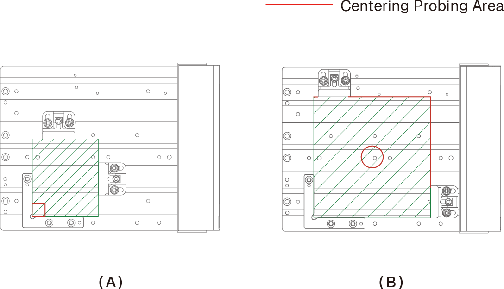{width=12cm}

### When Using the Flat Panel Clamps

Using the clamping setup shown below as an example:

- All four sides of the material must be probed.
- Measure the Z-axis height at any point.

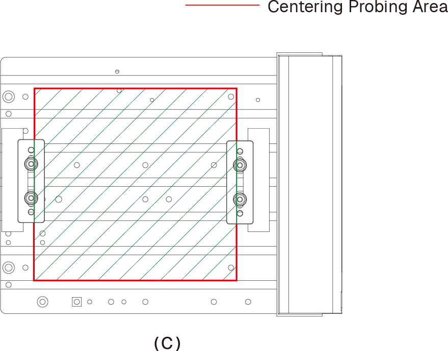{width=10cm}

### X-Axis and Y-Axis Size Limits

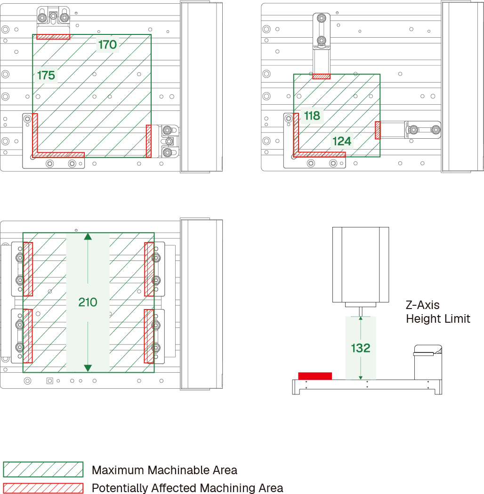{width=10cm}

## OK Clamp

### Preparation

Prepare the following materials and tools:

- L-shaped locating fixture ×1
- OK clamps ×2
- φ4×10 locating pins ×2
- M6×12 or M6×20 hex socket screws ×3
- M6×20 T-slot bolts ×4
- M6 flange nuts ×4
- 5 mm hex key
- 10 mm wrench or socket wrench

### OK Clamp Installation

1. Pre-install the T-slot bolts and flange nuts on the OK clamps.
2. Adjust the orientation of the T-slot bolts so that they can slide into the T-slots.
3. Place the OK clamps in the T-slots and slide them into the appropriate positions.

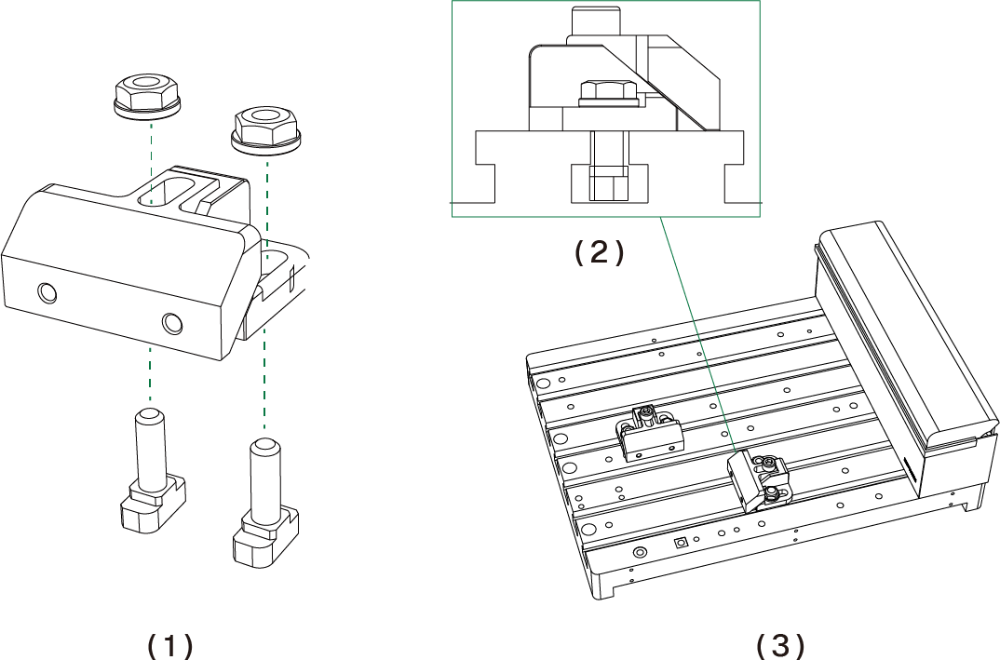{width=10cm}

### L-Shaped Locating Fixture Positions and Restrictions

The L-shaped locating fixture has two installation positions, one for laser engraving and the other for CNC machining.

All the following examples use the CNC machining setup.

- Laser Engraving 4th-Axis
- CNC Vise-B

The following two sizes are available. Select one for installation based on the clearance required for the workpiece.

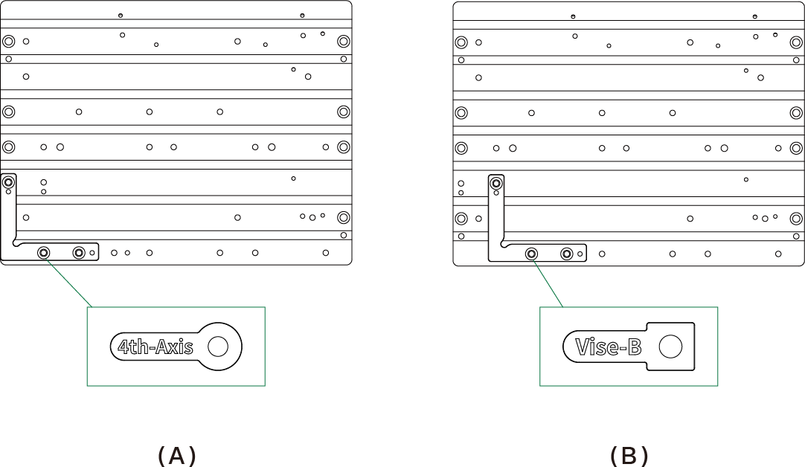{width=10cm}

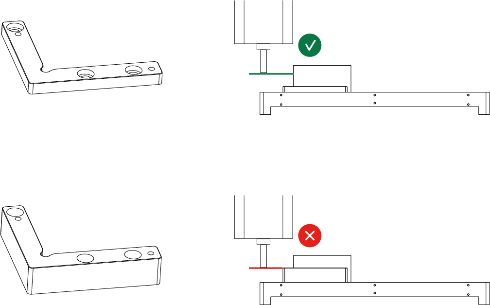{width=10cm}

### Fixture and Clamp Positioning

1. Install the locating pins for the L-shaped locating fixture.
2. Install the hex socket screws for the L-shaped locating fixture.

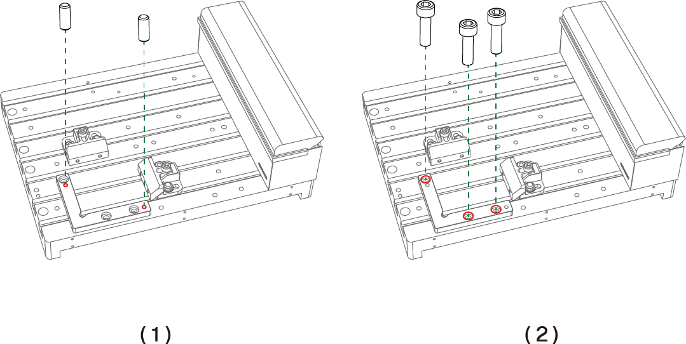{width=12cm}

3. Place the stock on the worktable. Make sure that two sides of the stock are flush against the inner faces of the L-shaped locating fixture, and position the clamp sliders as close to the workpiece surface as possible.
4. Rotate the T-slot bolts 90°.

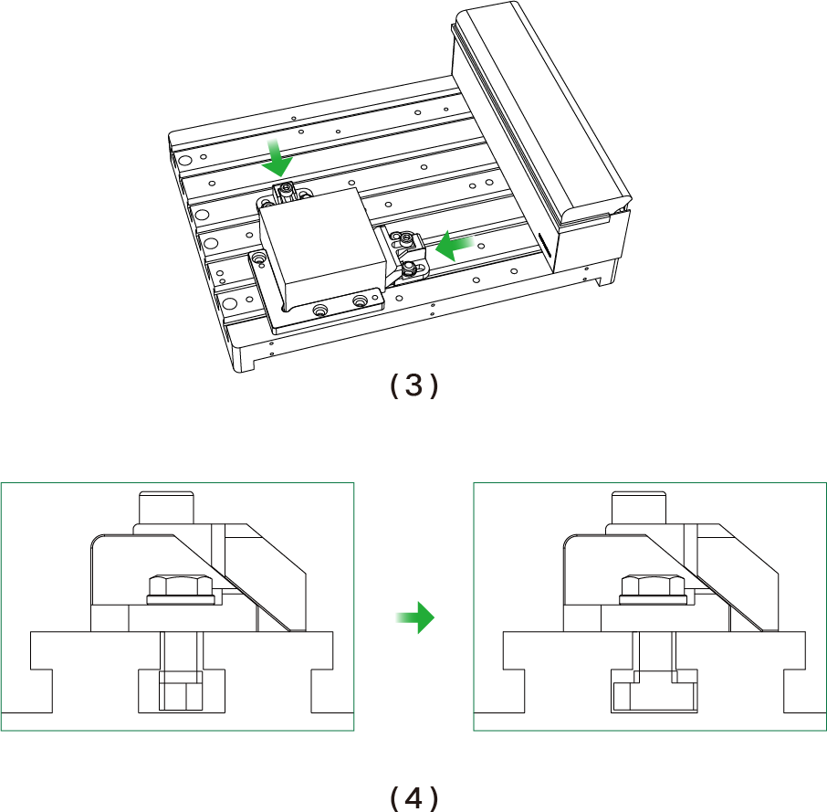{width=12cm}

### Final Tightening

1. Use a socket wrench to tighten the flange nuts on the OK clamps.
2. Use a hex key to tighten the clamping screws on the OK clamps.

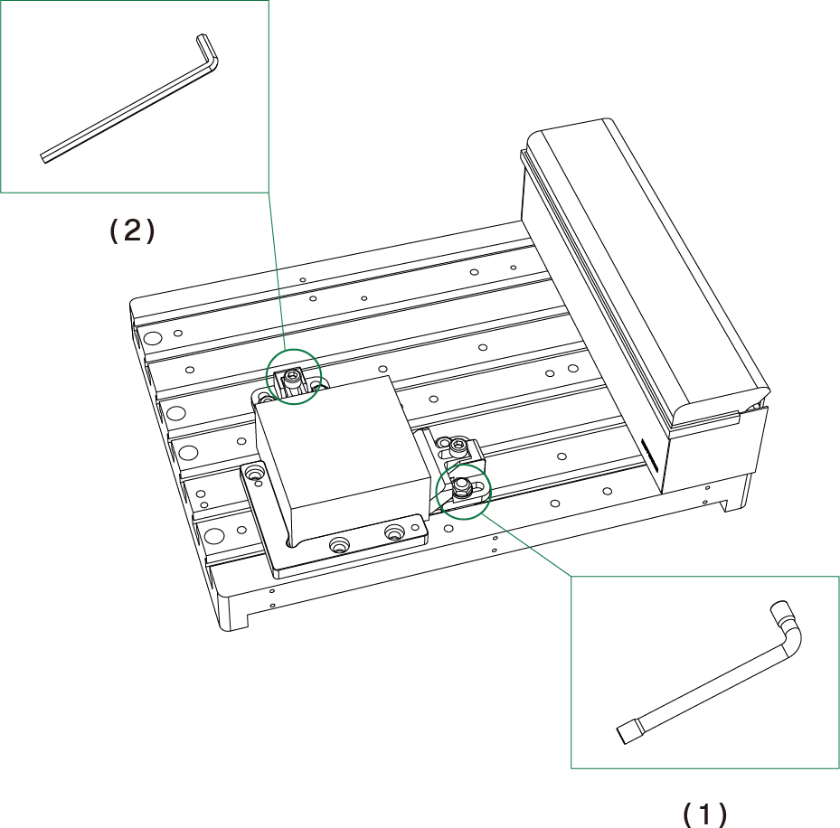{width=10cm}

### Completed Installation Example

The following image shows the complete installation of the L-shaped locating fixture and OK clamps on the C500 worktable.

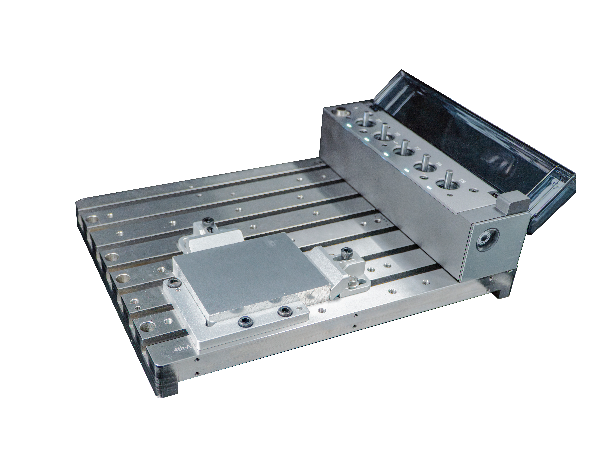{width=10cm}

## Side Clamp

### Preparation

Prepare the following materials and tools:

- L-shaped locating fixture ×1
- Side clamps ×2
- φ4×10 locating pins ×2
- M6×12 or M6×20 hex socket screws ×3
- M6×20 T-slot bolts ×4
- M6 flange nuts ×4
- 5 mm hex key
- 10 mm wrench or socket wrench

> [!note] T-Slot Bolt Orientation
> T-slot bolts are used to tighten and secure the clamps. Insert each T-shaped head lengthwise into a T-slot on the worktable, move it to the appropriate position, rotate it 90°, and then tighten the flange nut.

### Side Clamp Installation

1. Pre-install the T-slot bolts and flange nuts on the side clamps.
2. Adjust the orientation of the T-slot bolts so that they can slide into the T-slots.
3. Place the side clamps in the T-slots and slide them into the appropriate positions.

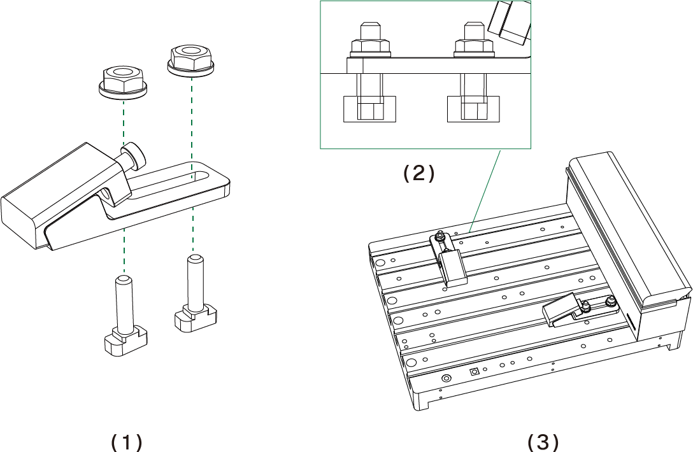{width=12cm}

### L-Shaped Locating Fixture Positions and Restrictions

The L-shaped locating fixture has two installation positions, one for laser engraving and the other for CNC machining.

All the following examples use the CNC machining setup.

- Laser Engraving 4th-Axis
- CNC Vise-B

The following two sizes are available. Select one for installation based on the clearance required for the workpiece.

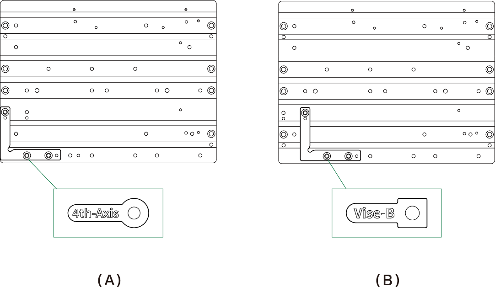{width=12cm}

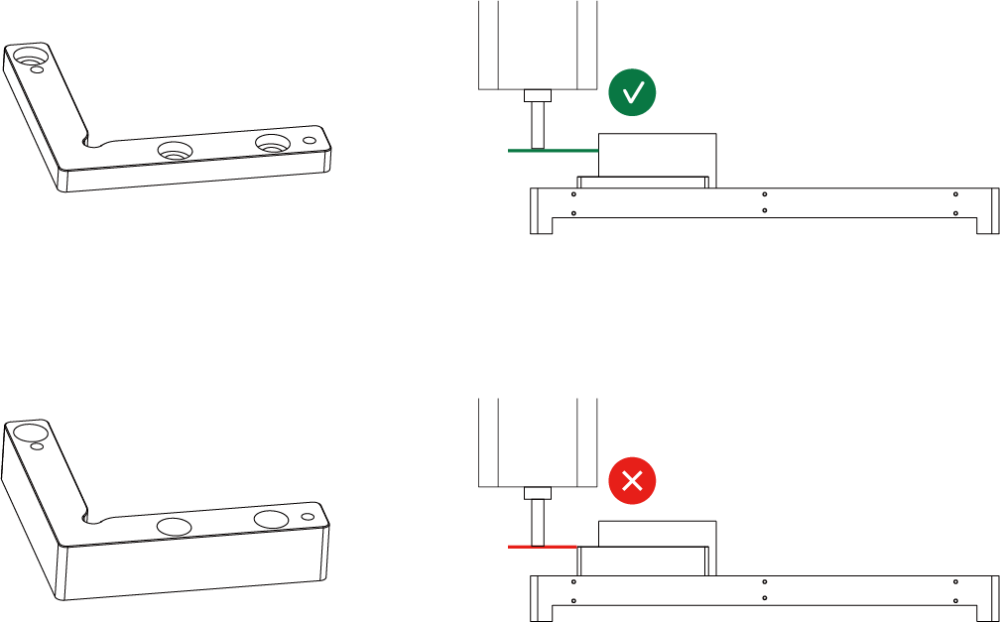{width=12cm}

### Fixture and Clamp Positioning

1. Install the locating pins for the L-shaped locating fixture.
2. Install the hex socket screws for the L-shaped locating fixture.

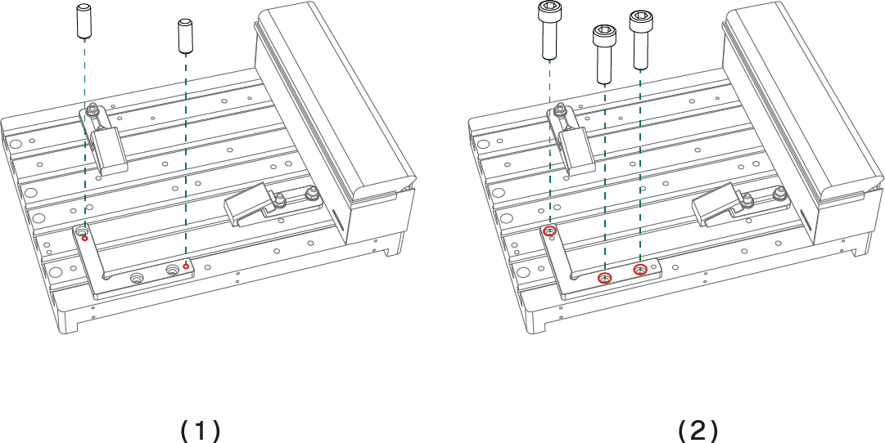{width=12cm}

3. Place the stock on the worktable. Make sure that two sides of the stock are flush against the inner faces of the L-shaped locating fixture, and position the clamp sliders as close to the workpiece surface as possible.
4. Rotate the T-slot bolts 90°.

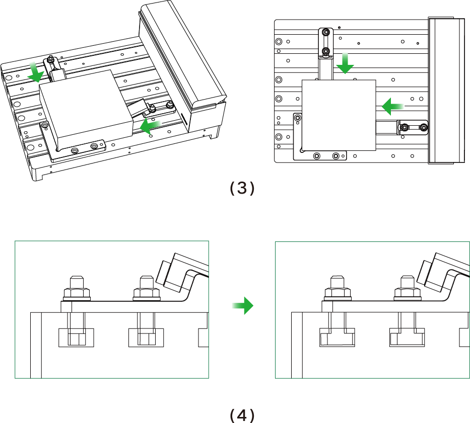{width=12cm}

### Final Tightening

1. Use a socket wrench to tighten the flange nuts on the side clamps.
2. Use a hex key to tighten the clamping screws on the side clamps.

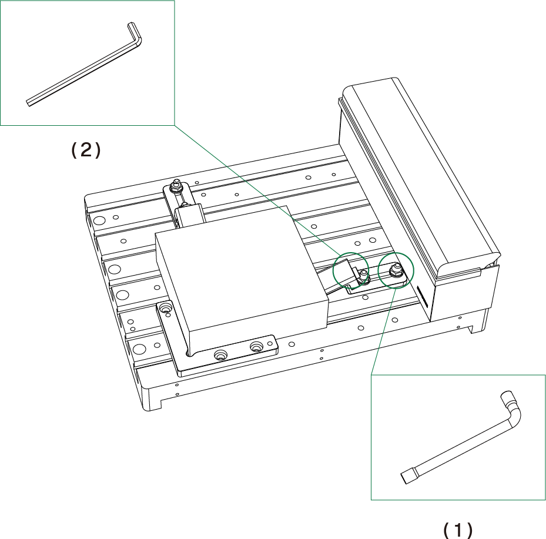{width=10cm}

### Completed Installation Example

The following image shows the complete installation of the L-shaped locating fixture and side clamps on the C500 worktable.

{width=8cm}

## Flat Panel Clamp

Flat panel clamps are suitable for machining applications involving larger stock and relatively high machining loads.

Flat panel clamps can be used in various configurations. Select a suitable setup based on the workpiece and stock dimensions.

### Preparation

Prepare the following materials and tools:

- Flat panel clamps ×4
- M6×25 or M6×35 T-slot bolts ×8
- M6 flange nuts ×8
- Custom auxiliary spacer blocks ×2
- 5 mm hex key
- 10 mm wrench or socket wrench

During installation, provide suitable auxiliary spacer material based on the workpiece to be machined. The side with more clearance should always correspond to the thicker item, whether that item is the workpiece or the auxiliary spacer material.

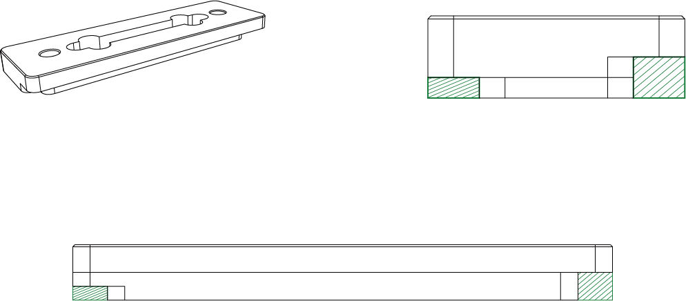{width=10cm}

### Installation

1. Ensure as much surface contact as possible between the flat panel clamps, workpiece, and auxiliary spacer material.
2. Move the clamp plate so that the bolt enters the lateral locating half-hole in the clamp plate slot, with the bolt positioned closer to the workpiece.
3. After installation, rotate the T-slot bolts 90°, then use a socket wrench to tighten all the flange nuts.

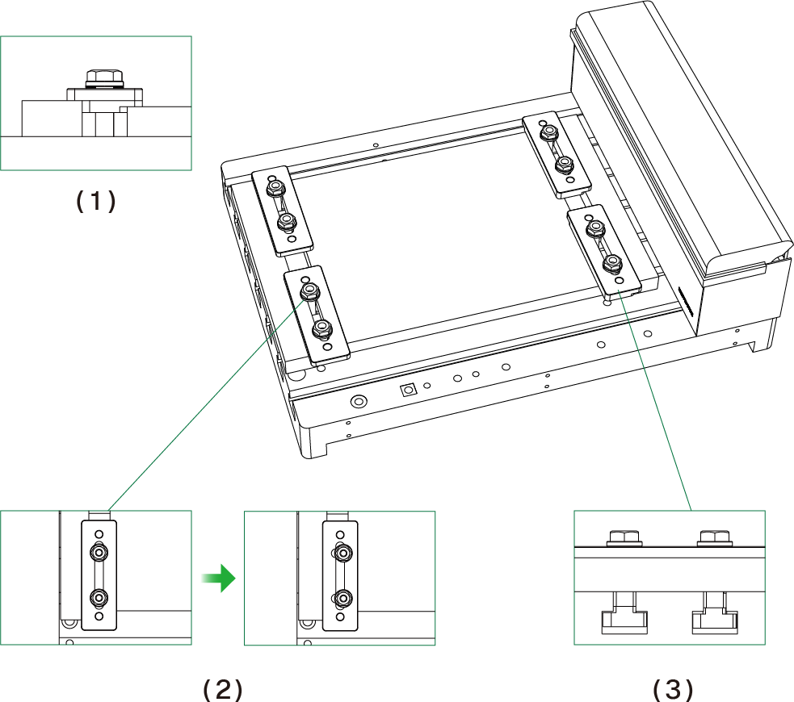{width=12cm}

When the flat panel clamps are used horizontally, position the T-slot bolts near both ends of the flat panel clamps.

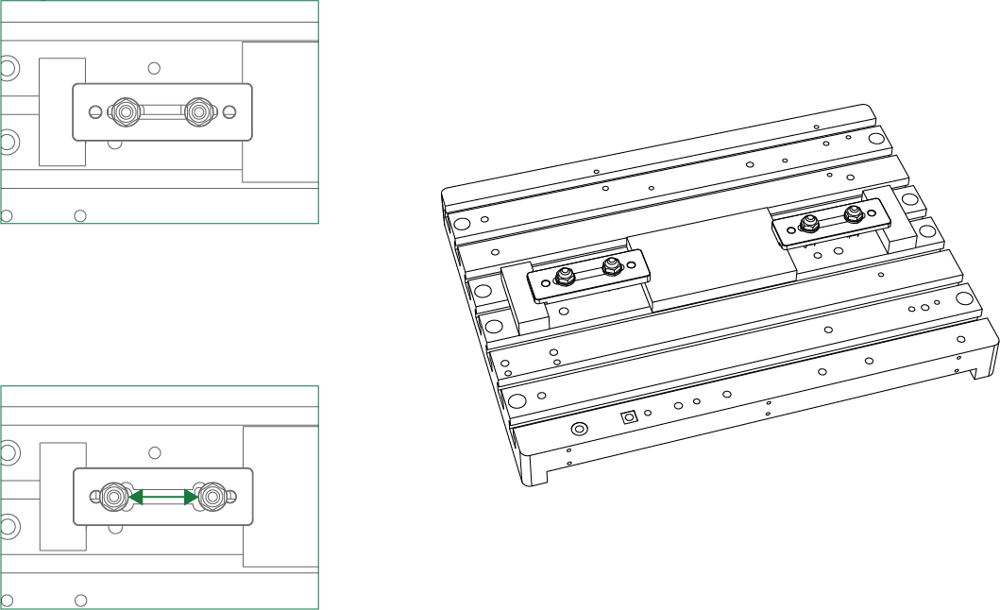{width=10cm}

### Completed Installation Example

The following image shows the complete installation of the flat panel clamps, stock, and auxiliary spacer blocks on the C500 worktable.

{width=10cm}

| No. | Name |
| --- | --- |
| 1 | Flat Panel Clamp |
| 2 | Stock |
| 3 | Auxiliary Spacer Block |

> [!caution] Caution
> - Tighten the mounting screws with appropriate force. Do not over-tighten them, as this may damage the threads on the worktable, clamps, or clamp plates.
> - Ensure that the clamp plates remain parallel after installation to prevent uneven clamping force or machining position deviations.
> - Avoid damaging the workpiece surface directly with the clamp plates. If necessary, place a soft cloth or protective pad at the contact points.
> - Before machining, verify that the clamps, fasteners, and workpiece are securely fixed and will not interfere with the travel path of the spindle, cutting tool, or probe.

## Sacrificial Board - X-Axis

If through-cutting is required, use the Sacrificial Board - X-Axis supplied with the kit.

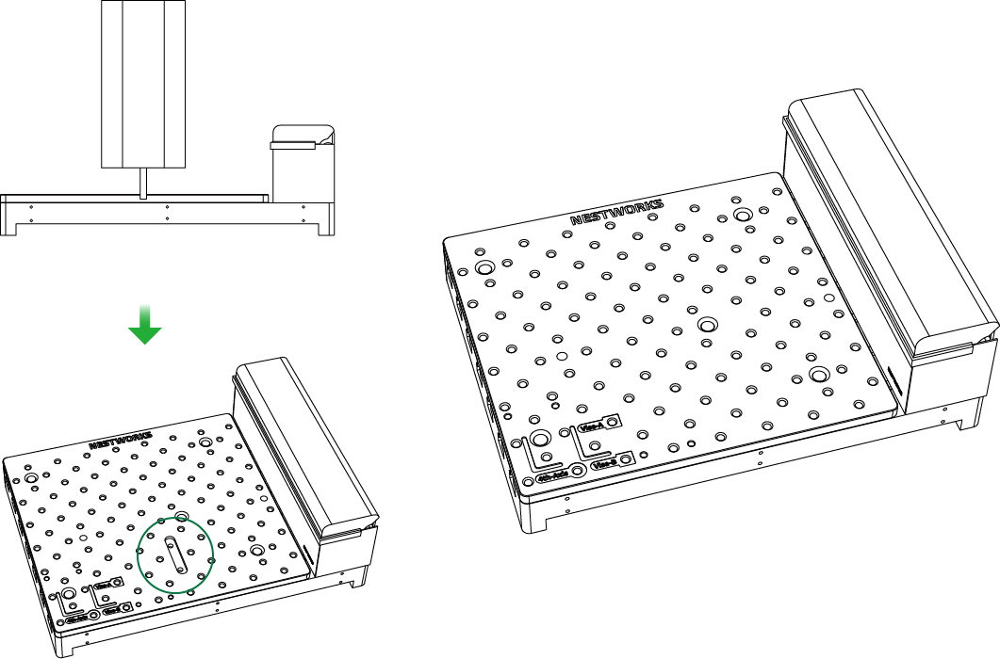{width=12cm}

1. Use countersunk screws to install the Sacrificial Board - X-Axis on the worktable. The holes in the board have M6 threads, allowing the L-shaped locating fixtures, clamps, and flat panel clamps to be installed directly on the board using M6 hex socket screws.

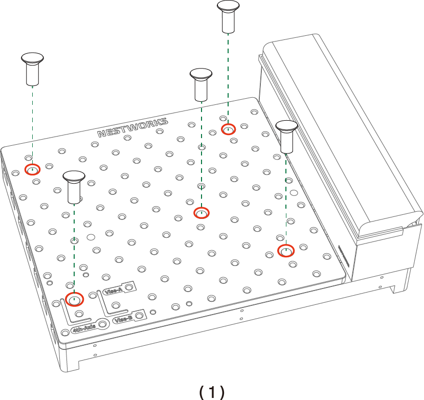{width=10cm}

2. Align the holes in the L-shaped locating fixture with the corresponding CNC holes in the Sacrificial Board - X-Axis, and then insert the locating pins.
3. Install the hex socket screws for the L-shaped locating fixture.

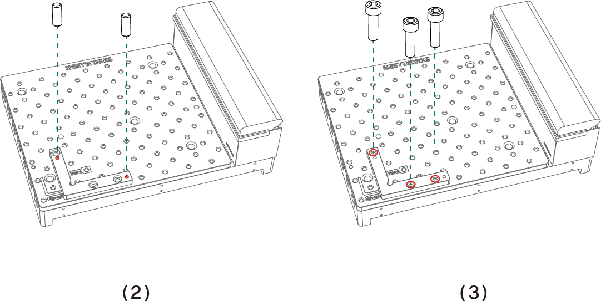{width=12cm}

4. Install the OK clamps directly in suitable positions on the board using M6 screws.
5. Tighten the clamping screws on the OK clamps.

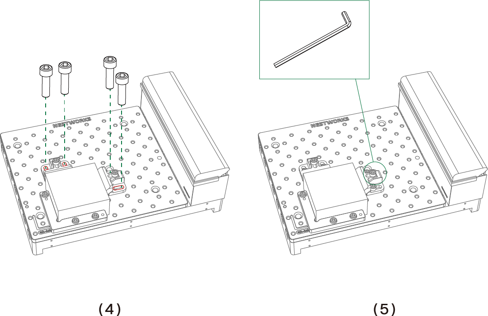{width=12cm}
