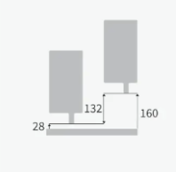
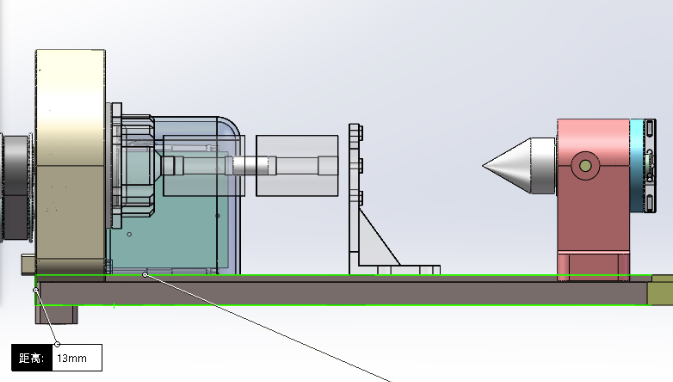

### Maximum Machinable Diameter in 4-Axis Mode

The 4-axis clamping space is Φ80 mm. When tool protrusion, base plate clearance, and safety clearance requirements are met, the maximum machinable diameter is Φ100 mm.

Taking a 50 mm tool as an example, if the tool clamping length is 15 mm, the tool protrusion length is 35 mm. The theoretical space in the 4-axis area is 160 mm. After deducting the tool protrusion length, the 13 mm thickness of the 4-axis base plate, and the 12 mm upper and lower safety clearance, the machinable diameter is:

50 mm - 15 mm = 35 mm

160 mm - 35 mm - 13 mm - 12 mm = 100 mm

Therefore, under these conditions, the maximum machinable diameter in 4-axis mode is Φ100 mm.

{width=5cm} {width=8.5cm}

<!-- mdwb:figure id=54b1c1d6c21aff24 -->
Figure 9-7 Maximum Machinable Diameter in 4-Axis Mode
<!-- /mdwb:figure -->

