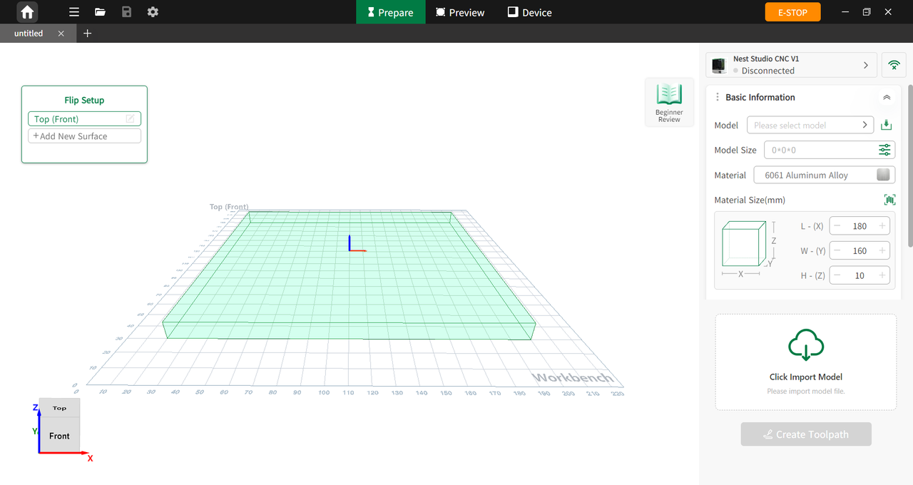

### Overview

**NestStudio** is a lightweight programming and collaborative control software designed for desktop CNC machines. With an integrated project-based workflow, intelligent toolpath algorithms, and a user-friendly interface, it delivers an efficient and smooth CNC experience for both beginners and professional users.

{width=12cm}

<!-- mdwb:figure id=bd068506716f51a7 -->
Figure 5-1 Overview
<!-- /mdwb:figure -->

