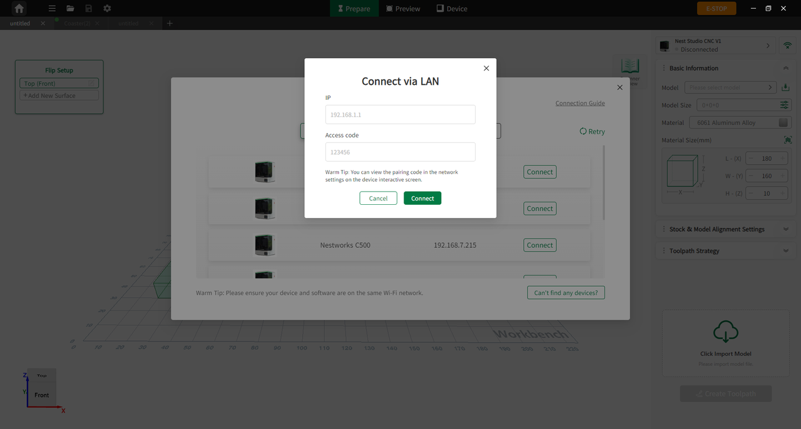

#### Wireless Connection

Connect the machine and the software to the same Wi-Fi network. View the IP address and pairing code on the machine touchscreen, then enter them in NestStudio.

{width=12cm}

<!-- mdwb:figure id=2b8c9dbe80d8e56f -->
Figure 5-4 Wireless Connection
<!-- /mdwb:figure -->

