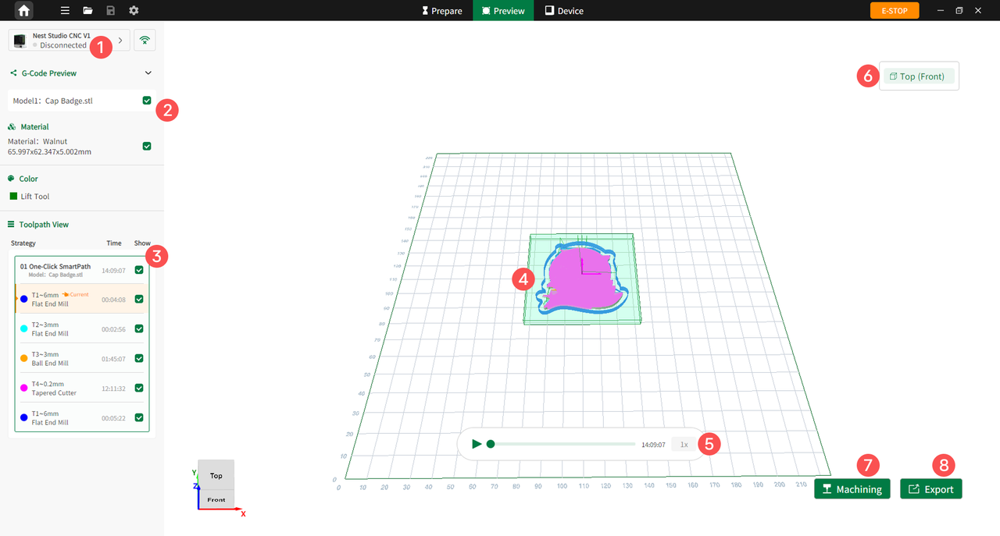

### Preview Page

Click **Preview** in the center of the top toolbar to enter the Preview interface. Users can review the generated toolpath effects, strategy parameters, and machining paths, and proceed directly to machining or export the G-code file.

{width=12cm}

<!-- mdwb:figure id=b9d86b5ccf4981b2 -->
Figure 6-8 Preview Page
<!-- /mdwb:figure -->

| **No.** | **Feature**          | **Description**                                                                                                                          |
| ------- | -------------------- | ---------------------------------------------------------------------------------------------------------------------------------------- |
| 1       | **Device Status**    | Displays the current connection status. If disconnected, users can click the icon on the right to connect via wired or wireless methods. |
| 2       | **G-Code Preview**   | Allows users to show or hide the preview status of the model, material, and related display items.                                       |
| 3       | **Tool path View**   | Displays each machining step, including the strategy, estimated machining time, tool type, and tool visibility status.                   |
| 4       | **Toolpath Preview** | Displays the actual machining paths of the tool in the worktable view.                                                                   |
| 5       | **Playback Control** | Controls the toolpath simulation playback, including play, pause, progress adjustment, and playback speed.                               |
| 6       | **Top (Front)**      | Displays the current machining face. Users can switch to the specific face to be machined.                                               |
| 7       | **Machining**        | Starts machining when the device is connected.                                                                                           |
| 8       | **Export**           | Exports the G-code file.                                                                                                                 |
