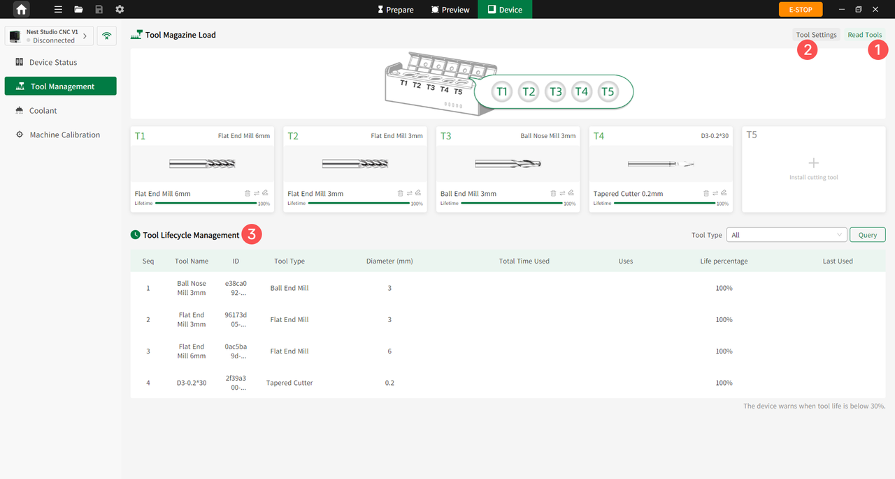

#### Tool Management

Click **Tool Management** to enter the Tool Management page. Users can read tool information, configure tool parameters, and manage tool life.

{width=12cm}

<!-- mdwb:figure id=deec77ba9a7e63d2 -->
Figure 6-10 Tool Management
<!-- /mdwb:figure -->

| No. | Feature                   | Description                                                                                                                      |
| --- | ------------------------- | -------------------------------------------------------------------------------------------------------------------------------- |
| 1   | Read Tools                | After connecting the device, quickly read RFID information for the 5 tools in the tool magazine and display it on the interface. |
| 2   | Tool Settings             | Customize tool parameters.                                                                                                       |
| 3   | Tool Lifecycle Management | Displays the remaining tool life percentage. A warning is triggered when below 30%, allowing timely tool replacement.            |

