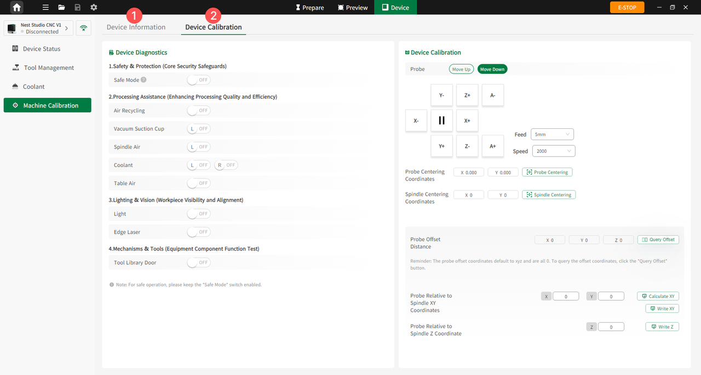

#### Machine Calibration

Click **Machine Calibration** in the left menu of the Device interface to access the Machine Calibration page. This interface is divided into two subpages: **Device Information** and **Device Calibration**, for viewing device status, parameters, and performing calibration operations.

{width=12cm}

<!-- mdwb:figure id=ca82ed22b158cbb0 -->
Figure 6-12 Machine Calibration
<!-- /mdwb:figure -->

| No. | Subpage            | Modules & Description                                                                                                                                                                                                                                                                                                                                                                                                                  |
| --- | ------------------ | -------------------------------------------------------------------------------------------------------------------------------------------------------------------------------------------------------------------------------------------------------------------------------------------------------------------------------------------------------------------------------------------------------------------------------------- |
| 1   | Device Information | **Device Info**: View device model, connection type, total operating hours, and firmware version; configure startup homing. **Status Parameters**: Monitor spindle core status, actual feed and spindle speed, machine coordinates and workpiece coordinates, machine status, current tool number, and G-code execution. **Machine Parameters**: View machine parameters, including maximum spindle speed and machine structure. |
| 2   | Device Calibration | **Device Diagnostics**: Check device status and component functions. **Device Calibration**: Adjust device precision and related parameters, such as probe centering coordinates and spindle centering coordinates.                                                                                                                                                                                                                 |

