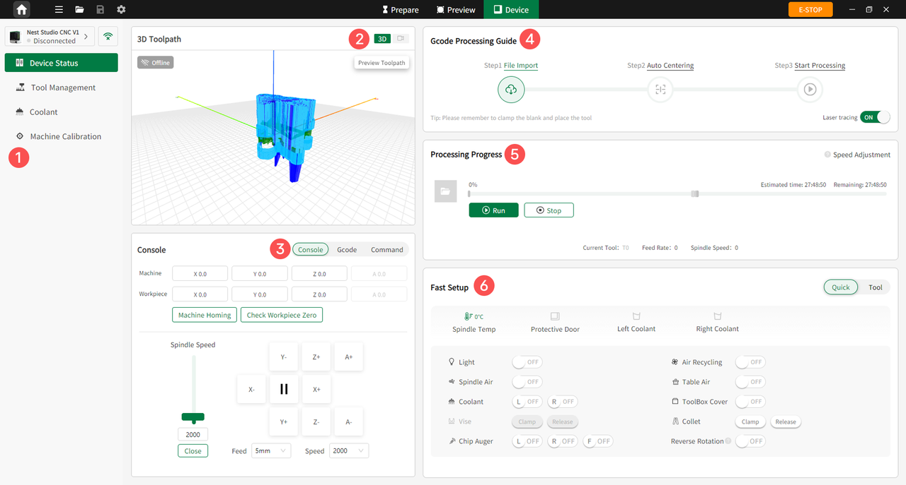

### Device Page

Click **Device** to enter the Device interface. Users can monitor the machining video in real time, view processing step guides and progress, and perform quick equipment debugging and parameter intervention.

{width=12cm}

<!-- mdwb:figure id=be7233f2a379029c -->
Figure 6-9 Device Page
<!-- /mdwb:figure -->

| **No.** | **Feature**                    | **Description**                                                                                                                                                                                                                                                                   |
| ------- | ------------------------------ | --------------------------------------------------------------------------------------------------------------------------------------------------------------------------------------------------------------------------------------------------------------------------------- |
| 1       | **Left Menu Bar**              | Access features such as Device Status, Tool Management, Coolant Management, and Machine Calibration.                                                                                                                                                                              |
| 2       | **Machining Video Monitoring** | Monitors the machining video in real time and previews the toolpath.                                                                                                                                                                                                              |
| 3       | **Console**                    | Debug machine or workpiece coordinates, set machine home, check workpiece zero, and adjust spindle speed and feed rate.                                                                                                                                                           |
| 4       | **G-code Guide**               | Guides users through the machining process: **Import File > Workpiece Centering > Start Machining**.                                                                                                                                                                              |
| 5       | **Machining Progress**         | Displays progress, including estimated and remaining time, as well as the current tool number, feed rate, and spindle speed.                                                                                                                                                      |
| 6       | **Quick Debugging**            | Quickly control the machine, including turning the work light, air purification, spindle cleaning, worktable cleaning, spray cooling, tool magazine door, vise, collet, and chip auger on or off. It also supports tool setting, tool return, and zero position reset operations. |

