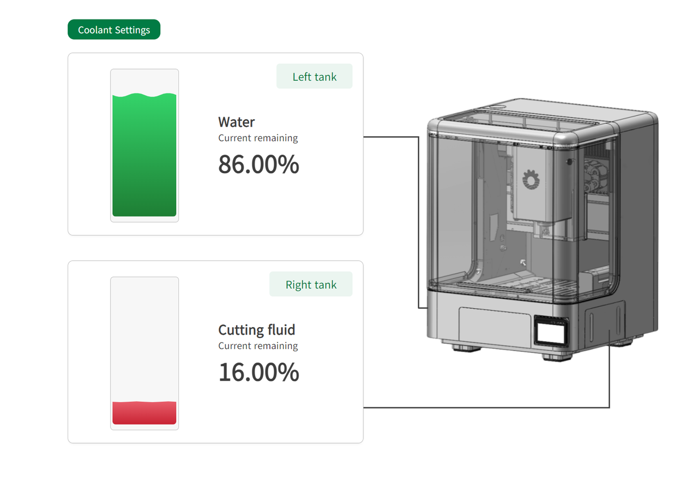

### Coolant Management

In the Coolant Management page, users can monitor the coolant level of the left and right tanks in real time, and configure coolant parameters.

{width=10cm}

<!-- mdwb:figure id=ae3533da93c6978b -->
Figure 6-19 Coolant Management
<!-- /mdwb:figure -->

> [!note] Notice
> Coolant is used for tool cooling and chip removal during machining, reducing the risk of tool overheating and wear.  
> When coolant level is sufficient, the level indicator appears green. When coolant level is low, the indicator appears red and enters warning status. Refill coolant promptly when necessary.

