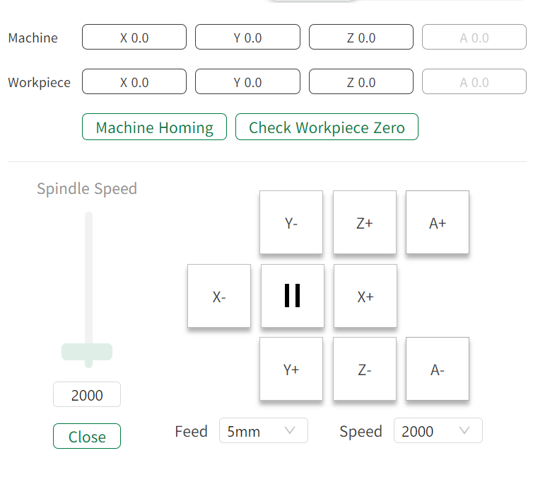

#### Console

Provides coordinate display, manual axis movement, spindle control, and zero reset functions for manual workpiece alignment and device debugging.

{width=8cm}

<!-- mdwb:figure id=c781e933cbd1fa7e -->
Figure 6-25 Console
<!-- /mdwb:figure -->

