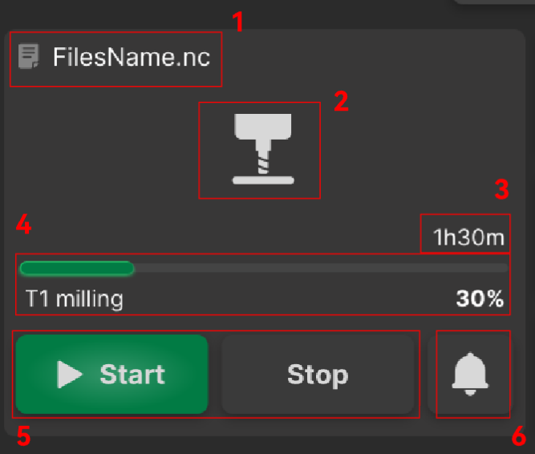
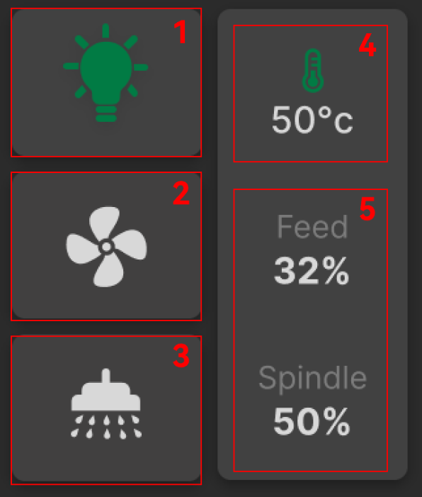

### Machining Control

The left side of the interface displays complete machining monitoring information and program control. Click **Start** to begin machining. The right side shows commonly used subsystem switches and status indicators for convenient device management.

{width=8cm}

<!-- mdwb:figure id=1871a960c988132c -->
Figure 6-2 Machining Control
<!-- /mdwb:figure -->

| No. | Item                                 | Description                                                                                                                                        |
| --- | ------------------------------------ | -------------------------------------------------------------------------------------------------------------------------------------------------- |
| 1   | File Name                            | Displays the name of the currently machining file.                                                                                                 |
| 2   | Machining Status / File Preview      | Shows the machining status and a preview of the file.                                                                                              |
| 3   | Estimated Machining Time             | Displays the system-estimated processing time.                                                                                                     |
| 4   | Progress Bar & Completion Percentage | Shows real-time machining progress.                                                                                                                |
| 5   | Program Control                      | Includes Start, Pause, and Stop. In case of an abnormality, machining automatically pauses. Users can resume processing after resolving the issue. |
| 6   | Error Log                            | Click to view all error and exception records.                                                                                                     |

{width=8cm}

<!-- mdwb:figure id=a4920ccedfbdf506 -->
Figure 6-3 Machining Control
<!-- /mdwb:figure -->

| No. | Module               | Description                                                                   |
| --- | -------------------- | ----------------------------------------------------------------------------- |
| 1   | Built-in Lighting    | Single click toggles the on/off state.                                        |
| 2   | Cleaning System      | Controls air purification, worktable cleaning, and debris blow-off functions. |
| 3   | Cooling System       | Controls left and right coolant spray.                                        |
| 4   | Temperature Display  | Shows real-time temperature of the spindle or machining area.                 |
| 5   | Feed / Spindle Speed | Displays real-time feed rate and spindle speed percentages.                   |

