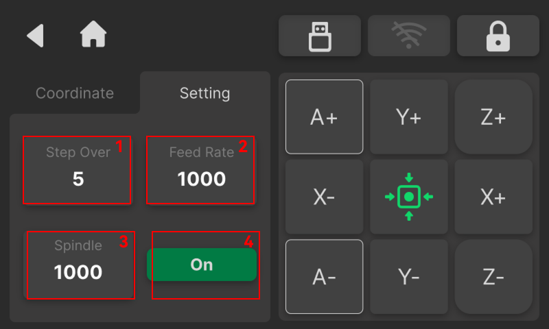

### Motion Parameter Settings

{width=12cm}

<!-- mdwb:figure id=44a7cb70df1b372f -->
Figure 6-9 Motion Parameter Settings
<!-- /mdwb:figure -->

| **No.** | **Name**           | **Description**                                                                                                                                                                                                                                                                                                                 |
| ------- | ------------------ | ------------------------------------------------------------------------------------------------------------------------------------------------------------------------------------------------------------------------------------------------------------------------------------------------------------------------------- |
| 1       | **Step Over**      | Sets the motion mode and single-step feed distance for manual axis movement. When **continuous motion mode** is selected, press and hold a direction control button to move the axis continuously. When a specific step value is selected, the system moves the axis by the selected distance for each jog operation. Unit: mm. |
| 2       | **Feed Rate**      | Controls the axis movement speed during cutting. Supports manual adjustment of the multiplier or setting a specific value to flexibly optimize machining efficiency based on material hardness and tool type. Unit: mm/min.                                                                                                     |
| 3       | **Spindle Speed**  | Controls the rotation speed of the tool. Continuously adjustable according to material and tool specifications to suit roughing or finishing processes. Unit: RPM.                                                                                                                                                              |
| 4       | **Spindle On/Off** | Manually turn the spindle on or off. Before enabling, the system displays a safety prompt reminding the user: "Do not touch the spindle to avoid injury."                                                                                                                                                                       |

