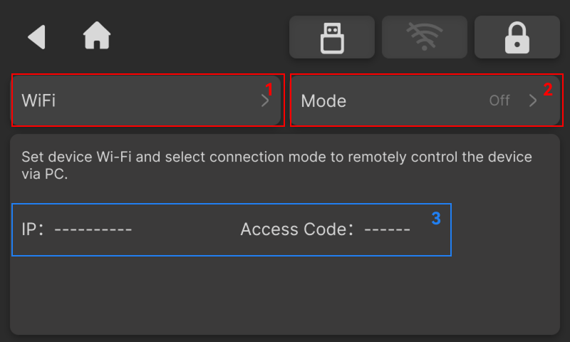

### Network Settings

The Network Settings page allows users to connect to a Wi-Fi network, obtain the latest software and firmware updates, log in to accounts, and establish remote or wired connections between the PC version of NestStudio and the device.

{width=12cm}

<!-- mdwb:figure id=7979f1580c1aa609 -->
Figure 6-12 Network Settings
<!-- /mdwb:figure -->

| No. | Item | Description |
| --- | --- | --- |
| 1 | Wi-Fi Settings | Connect to a wireless network |
| 2 | Connection Mode | Supports both LAN connection and direct Ethernet cable connection |
| 3 | Connection Information | Displays the information required to establish the connection, including the IP address and pairing code |

