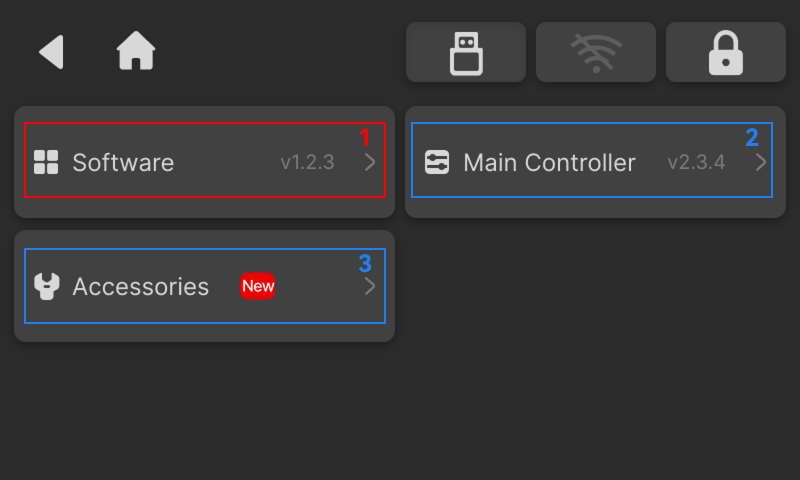

### Updates

The Updates page displays the current software and firmware version information. When a new version is detected, a **"New"** badge will be highlighted.

{width=12cm}

<!-- mdwb:figure id=72cb35660b4e5a97 -->
Figure 6-13 Updates
<!-- /mdwb:figure -->

| No. | Item                     | Description                                                                                                     |
| --- | ------------------------ | --------------------------------------------------------------------------------------------------------------- |
| 1   | Software Update          | Update the NestPad software version                                                                             |
| 2   | Main Controller Firmware | Update the main controller firmware                                                                             |
| 3   | Accessory Firmware       | Update firmware for device accessories, including the 4th-axis, MPG Handwheel, tool magazine, and electric vise |

> [!note] Notice
> During the update process, the system will automatically download and install the update package. Do not power off the device or disconnect the power supply during the update.

