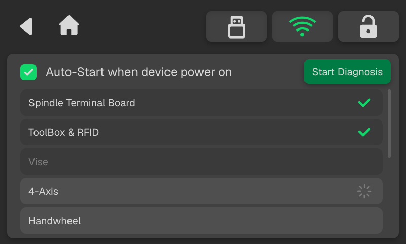
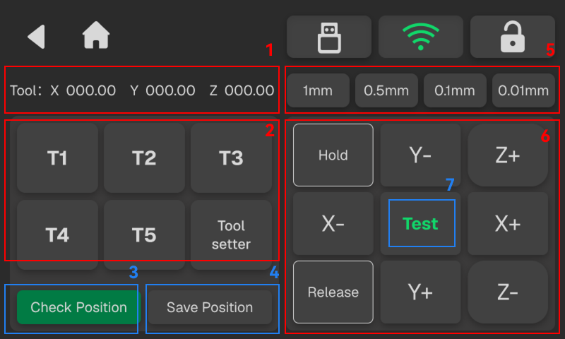
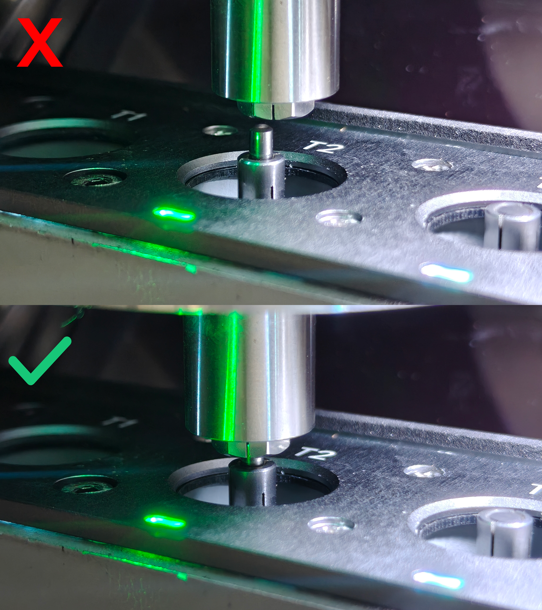

### Calibration and Tools

The Calibration and Tools page provides device self-check and device setup tools.

{width=12cm}

<!-- mdwb:figure id=65db7305869fbfe6 -->
Figure 6-15 Calibration and Tools
<!-- /mdwb:figure -->

1. After this function is enabled, the device automatically starts the self-check when powered on. You can also click **Start Diagnosis** on the current page to manually start the check and verify whether communication with each functional module is normal.

2. Tool Magazine Calibration

**Interface Description**

{width=12cm}

<!-- mdwb:figure id=7c306673c6957b2e -->
Figure 6-16 Calibration and Tools
<!-- /mdwb:figure -->

| No. | Name                   | Description                                                                                                                                                                |
| --- | ---------------------- | -------------------------------------------------------------------------------------------------------------------------------------------------------------------------- |
| 1   | **Coordinate Information** | Displays the X, Y, and Z coordinates of the currently selected tool or tool setter.                                                                                        |
| 2   | **Tool Number**            | Displays the tool setter and tool numbers. When an item is selected, the coordinate information above is updated accordingly.                                              |
| 3   | **Check Position**         | After selecting a tool or the tool setter, click this button. The spindle moves directly above the corresponding tool or tool setter so that its position can be checked.  |
| 4   | **Save Position**          | Saves and updates the current spindle coordinates as the coordinates of the selected tool or tool setter.                                                                  |
| 5   | **Jog Increment**          | Sets the distance the spindle moves each time a motion button is clicked.                                                                                                  |
| 6   | **Motion Panel**           | Supports spindle movement along the X, Y, and Z axes. Use the **Hold** and **Release** buttons to control the collet.                                                      |
| 7   | **Test Button**            | Click **Test** to perform a tool pickup or tool-setting operation based on the currently selected tool or tool setter, verifying whether the current position is accurate. |

**Calibration Procedure**

1. Select any tool position on the left and click **Check Position**. After the tool magazine cover opens, the spindle moves above the corresponding tool. Click **Release** to release the collet, and visually check whether the spindle is aligned with the tool.

2. Use the motion panel on the right to move the spindle and adjust its position. After confirming that the spindle is aligned with the tool, click **Save Position** to save and update the coordinates of the current tool position.

{width=10cm}
