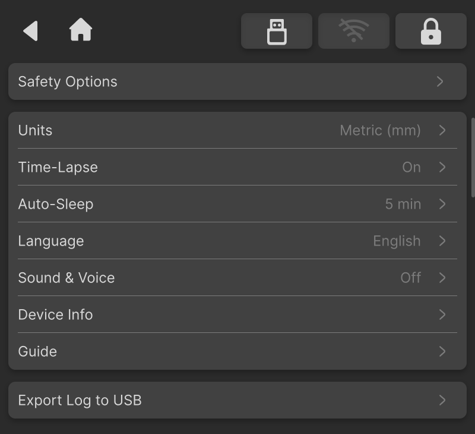

### Preferences

The Preferences page provides multiple device function and system parameter configuration options. Users can customize settings according to actual usage requirements.

{width=12cm}

<!-- mdwb:figure id=281543b3353ff8ca -->
Figure 6-17 Preferences
<!-- /mdwb:figure -->

| Name                | Description                                                                                                                                           |
| ------------------- | ----------------------------------------------------------------------------------------------------------------------------------------------------- |
| **Safety Settings** | Sets safety-related options for machine operation.                                                                                                    |
| **CNC Settings**    | Sets machining-related preferences, such as units and auto-sleep settings.                                                                            |
| **Time-Lapse**      | Turns the time-lapse function on or off to record the machining process.                                                                              |
| **Language**        | Switches the system display language, including Chinese, English, and other supported languages.                                                      |
| **Sound & Voice**   | Turns machine sound effects and voice prompts on or off.                                                                                              |
| **Device Info**     | Displays and manages device information, including editing the device nickname, viewing the usage time, and checking the unique device serial number. |
| **Export Log**      | Exports machine logs to a USB drive for troubleshooting by technical support personnel.                                                               |
