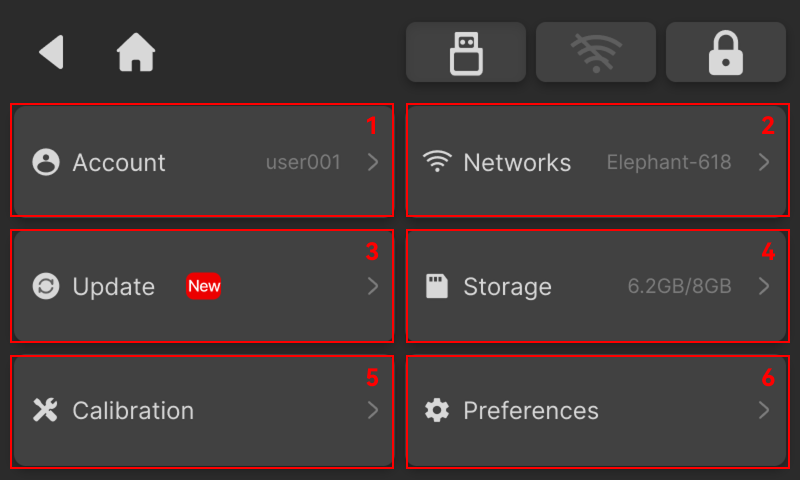

## Basic Settings

The NestPad Settings interface integrates basic device configuration, calibration tools, and personalized options. Users can configure related parameters and manage the device according to actual usage requirements.

{width=12cm}

<!-- mdwb:figure id=0a2fbf820525b74d -->
Figure 6-11 Basic Settings
<!-- /mdwb:figure -->

| No. | Item              | Description                                                                                                                                                                                                         |
| --- | ----------------- | ------------------------------------------------------------------------------------------------------------------------------------------------------------------------------------------------------------------- |
| 1   | Account           | Users can log in by scanning a QR code or manually entering an email address and password. After logging in, users can synchronize, access, and download favorited machining programs from the WorksBase community. |
| 2   | Network           | Supports wireless network connection and provides both LAN connection and direct Ethernet connection for local communication, allowing flexible switching according to usage scenarios.                             |
| 3   | Update            | Supports online detection and upgrade of device applications and hardware firmware.                                                                                                                                 |
| 4   | Storage           | Manage local storage and external devices. Perform operations such as file viewing, organization, and deletion.                                                                                                     |
| 5   | Calibration Tools | Provides multiple built-in calibration functions for device component calibration and debugging.                                                                                                                    |
| 6   | Preferences       | Provides various personalization options, including Safety Mode, system language, device sound settings, etc.                                                                                                       |

