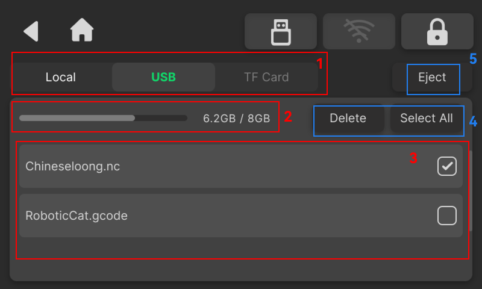

### Storage Management

Storage Management is used to manage file data stored in local storage, USB drives, and TF cards. It supports file viewing, deletion, and safe ejection operations.

{width=12cm}

<!-- mdwb:figure id=559a065c7fd62ae1 -->
Figure 6-14 Storage Management
<!-- /mdwb:figure -->

| No. | Item             | Description                                                       |
| --- | ---------------- | ----------------------------------------------------------------- |
| 1   | Storage Category | Switch between Local Storage, USB Drive, and TF Card pages        |
| 2   | Storage Space    | Displays the current storage usage and total capacity             |
| 3   | Files            | Displays the file names and file list in the current storage area |
| 4   | File Operations  | Supports file deletion and Select All operations                  |
| 5   | USB Eject        | Safely eject the USB storage device                               |

