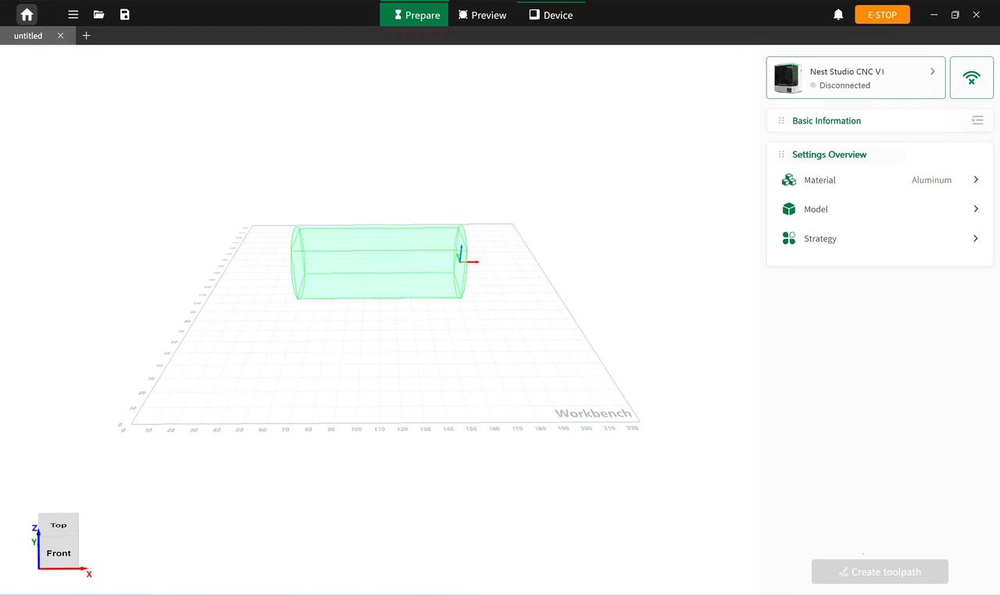

### 4-Axis Toolpath Preview

In 4-axis mode, users can complete model import, machining parameter configuration, and toolpath generation in the Ready page.

After toolpath generation is completed, the system automatically switches to the Preview page. Users can inspect toolpath trajectories, tool parameters, and machining paths to verify the machining plan before processing.

{width=12cm}

<!-- mdwb:figure id=a97a63108ba30ec7 -->
Figure 6-17 4-Axis Toolpath Preview
<!-- /mdwb:figure -->

