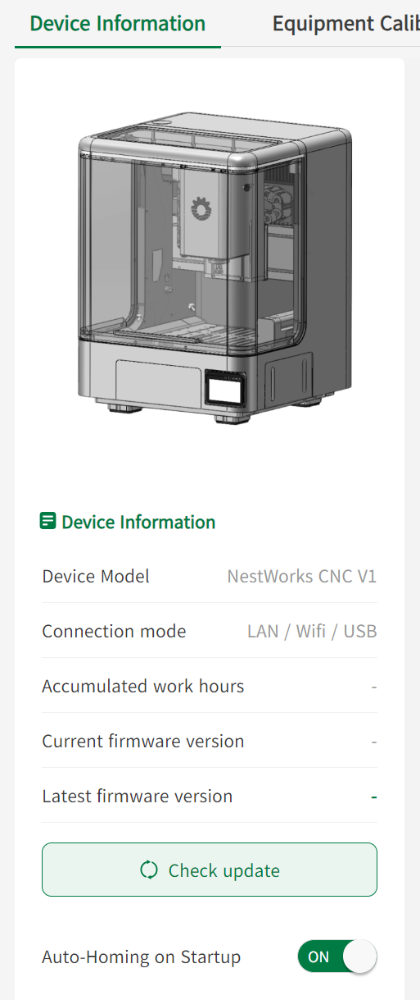
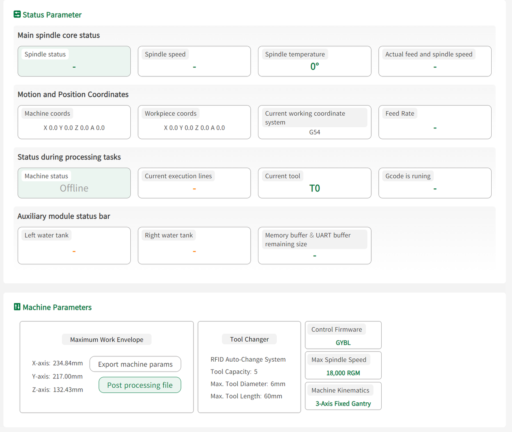

#### Device Information

**Basic Device Information**  

Displays device model, connection method, total operating time, and firmware version.

Users can also configure automatic homing and check firmware versions.

{width=8cm}

<!-- mdwb:figure id=b7040dc9b0d18696 -->
Figure 6-21 Device Information
<!-- /mdwb:figure -->

**Status Parameters**  

Displays real-time device status parameters, motion parameters, and machine parameters.

{width=12cm}

<!-- mdwb:figure id=89cf3e3af27f6e2f -->
Figure 6-22 Device Information
<!-- /mdwb:figure -->

