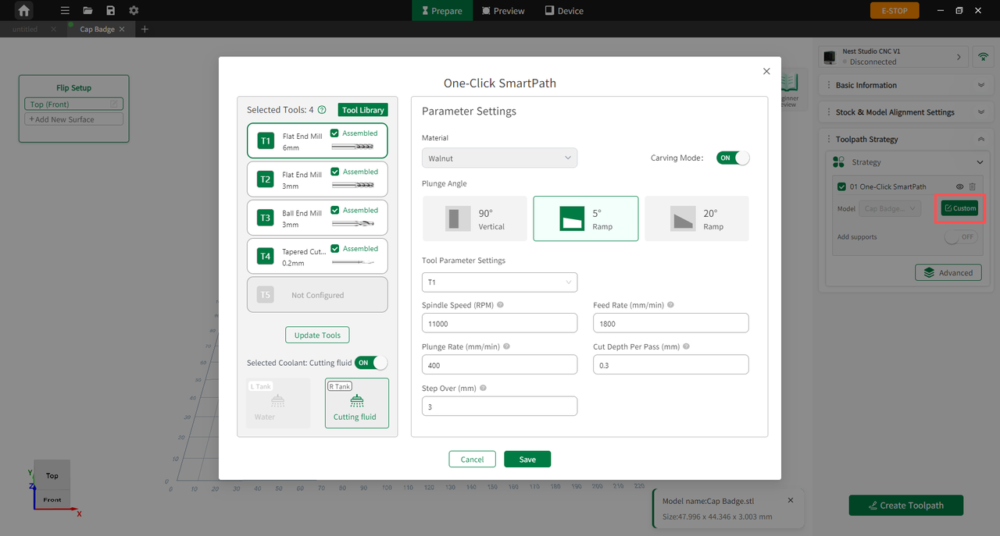
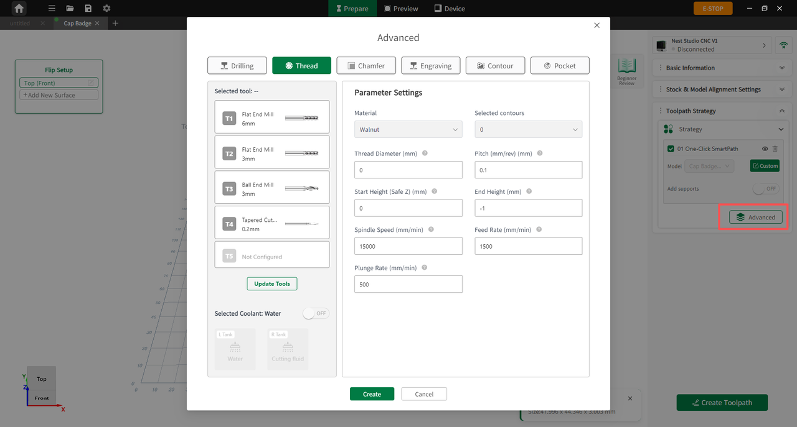

#### Custom Settings

**Smart Milling**

Enter the Smart Milling interface to adjust core machining parameters based on production requirements, such as tool parameters (plunge angle, spindle speed, feed rate, stepover, etc.) and coolant status.

{width=12cm}

<!-- mdwb:figure id=cd9e7085fb82498b -->
Figure 6-14 Custom Settings
<!-- /mdwb:figure -->

**Support Settings**

Users can enable or disable tabs or supports here, as well as customize their height, length, and placement:

* **Smart Generation**: Upon model import, the software automatically detects overhangs and structural proportions to place supports. If disabled, no supports will be generated.

* **Support Clearance**: Users can define the specific offset gap distance between the support structure and the model body.

**Advanced Settings**

The **Advanced** module provides granular control over toolpath strategies, covering specialized machining methods such as tapping, chamfering, engraving, profiling, and pocketing:

{width=12cm}

<!-- mdwb:figure id=01dba5e7095bc158 -->
Figure 6-15 Custom Settings
<!-- /mdwb:figure -->

* **Multi-Operation Machining**: Advanced settings allow users to add specific machining operations (such as drilling) on top of the Instant Mill configurations, accommodating complex multi-tasking workpieces.

* **Smart Parameter Recommendation**: In the Advanced mode, the software intelligently recommends optimal parameters for each specific operation type, removing the need for manual setup.

