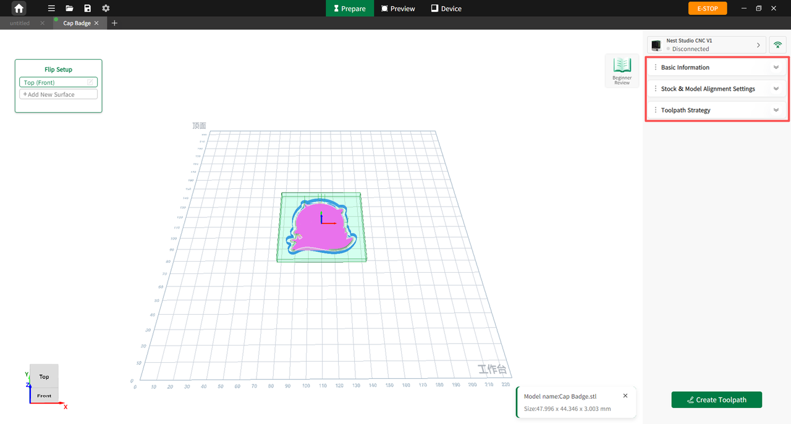

#### Parameter Overview

The parameter settings panel consists of three core sections: Stock, Model, and Process.

{width=12cm}

<!-- mdwb:figure id=d12c33b98292fd66 -->
Figure 6-13 Parameter Overview
<!-- /mdwb:figure -->

**Stock**

In the Stock tab, users can manually enter the length (**X**), width (**Y**), and height (**Z**) values of the raw stock, or use the Smart Material Detection feature to scan the material QR code for automatic input.

* **Stock Visibility Toggle**: Allows users to visually check the relative position between the model and the stock, assisting in better machining judgments.

* **Stock Masking**: When enabled, the stock acts as a boundary mask. It isolates the view to display only the toolpaths and model geometry within the stock boundaries while hiding anything outside, making it easier to troubleshoot overtravel or insufficient stock allowance.

**Model**

In the Model tab, users can adjust the model's position (**X**/**Y**/**Z** axes) and rotational orientation to ensure precise machining and maximize material utilization:

* **Position Fine-Tuning**: Users can precisely adjust the front/back, left/right, and up/down position of the model relative to the stock using the **+/-** buttons or by typing values directly into the input boxes.

* **Rotation Settings**: Users can manually input a specific rotation angle or click preset fixed values to orient the model around the **X-axis**, **Y-axis**, or **Z-axis**.

> [!note] Notice
> When adjusting the position or rotation angle, the left viewport on the Prepare page updates simultaneously in real time. Once rotated, the model's bounding box dimensions and values update automatically without requiring manual recalculation.

**Process**

After importing a model, the software automatically analyzes its geometry features and generates a default process strategy. The Process tab consists of two primary sections, **Smart Milling** and **Advanced**, which allow users to configure tools, supports, and coolant settings for individual models.

