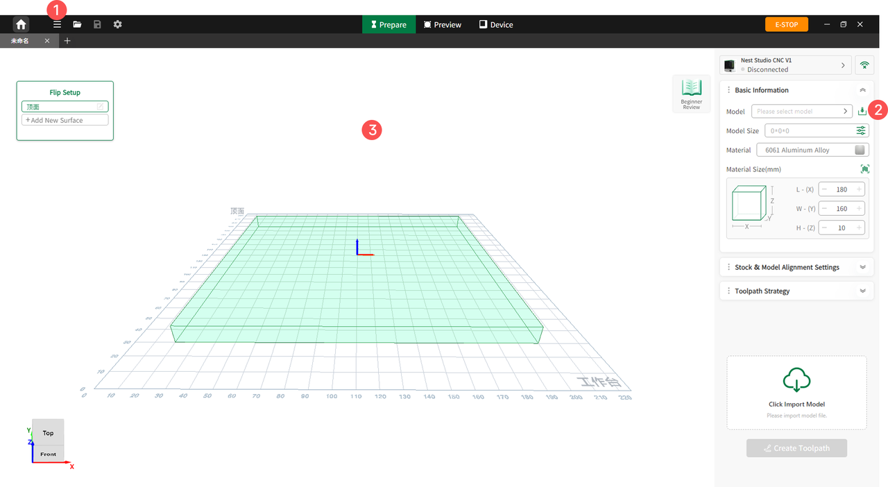

#### Import Methods

The software offers three methods to import models:

1. **Toolbar Import**: Click **File** (the second icon in the top toolbar), select **Import**, and choose based on the file type:
   
   - **Import 3D Model**: Opens a pop-up window for the user to select either a 3-Axis or 4-Axis layout interface.
   - **Import Program**: Automatically redirects to the Device Status page.

2. **Parameter Panel Import**: Click the **Import** icon in the right parameter panel to import a model.

3. **Drag and Drop**: Drag the target file directly from the computer desktop into the software workspace to complete the import.

{width=12cm}

