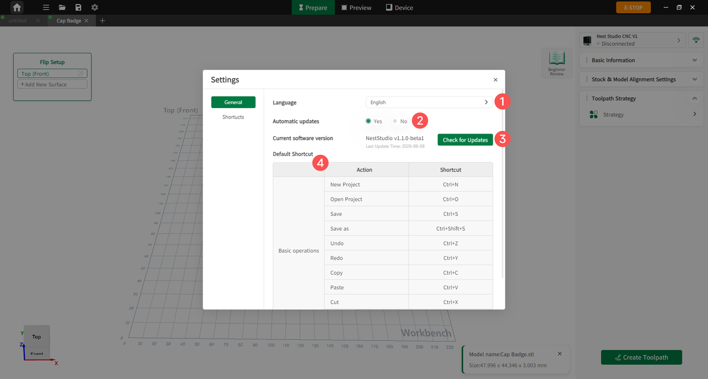

### Settings

{width=12cm}

<!-- mdwb:figure id=fc23f43597f248c4 -->
Figure 6-30 Settings
<!-- /mdwb:figure -->

| No. | Name                   | Function                                                                                                                                                                                |
| --- | ---------------------- | --------------------------------------------------------------------------------------------------------------------------------------------------------------------------------------- |
| 1   | **Language**           | Switch the software display language. The system language is detected automatically; if no matching language is available, English is displayed by default.                             |
| 2   | **Automatic  Updates** | When enabled, the software automatically checks for new versions at startup to obtain feature updates and bug fixes. When disabled, users need to click **Check for Updates** manually. |
| 3   | **Check for Updates**  | Manually checks whether the current software version is up to date. If a new version is detected, users can update the software according to the prompts.                               |
| 4   | **Shortcuts**          | Displays the shortcuts for common software functions, such as creating a new project, opening a project, saving, undoing, copying, and pasting.                                         |
