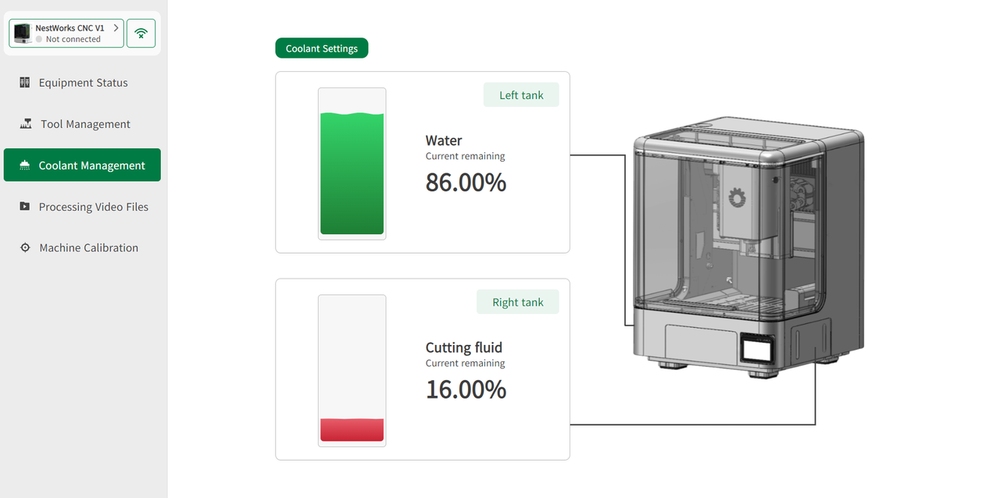

#### Coolant Management

Click **Coolant Management** to view the remaining coolant levels in the left and right tanks. Users can also add or configure coolant settings.

{width=12cm}

<!-- mdwb:figure id=e65ba42921222a3a -->
Figure 6-11 Coolant Management
<!-- /mdwb:figure -->

