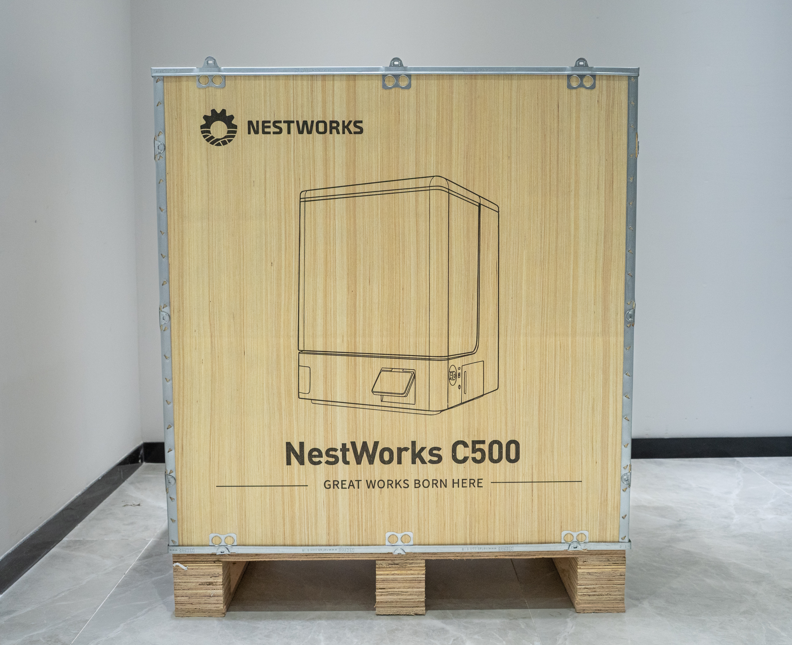

### Checking Packaging Status

Before unpacking, check the machine packaging and transport protection to make sure the packaging is intact and has not been damaged during transportation.

{width=10cm}

<!-- mdwb:figure id=acce3d62433923f3 -->
Figure 3-1 Checking Packaging Status
<!-- /mdwb:figure -->

