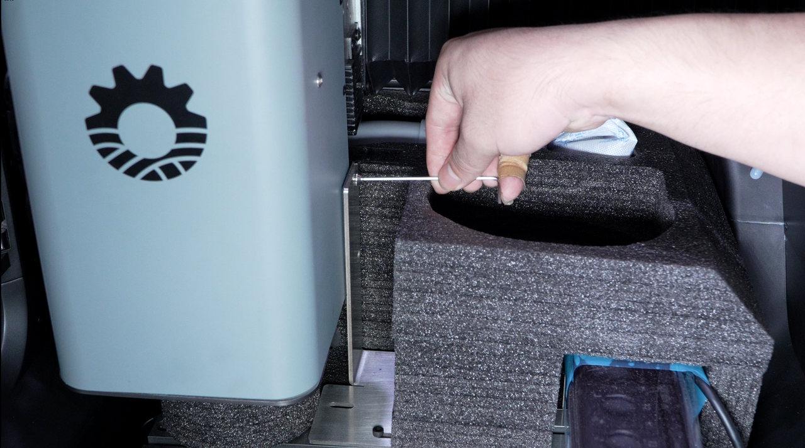
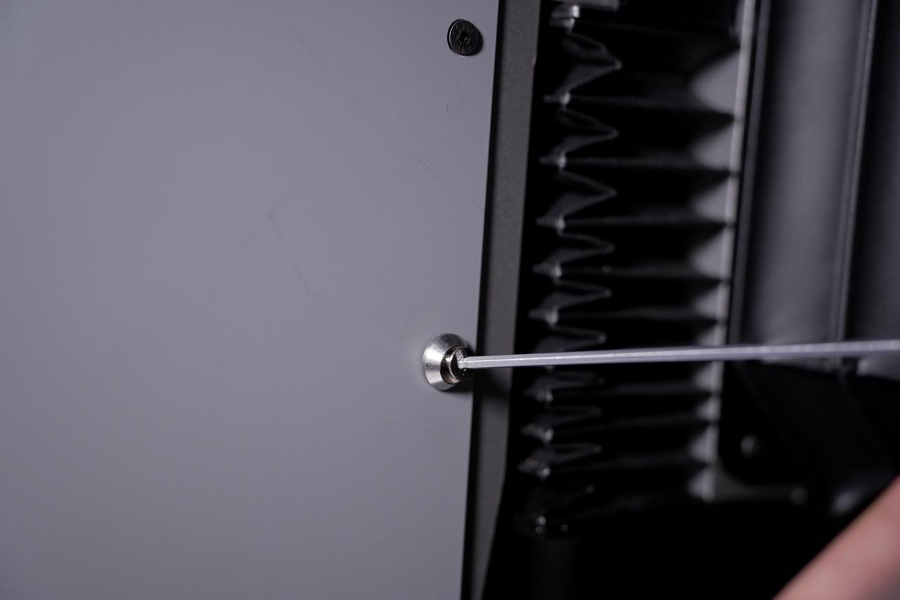
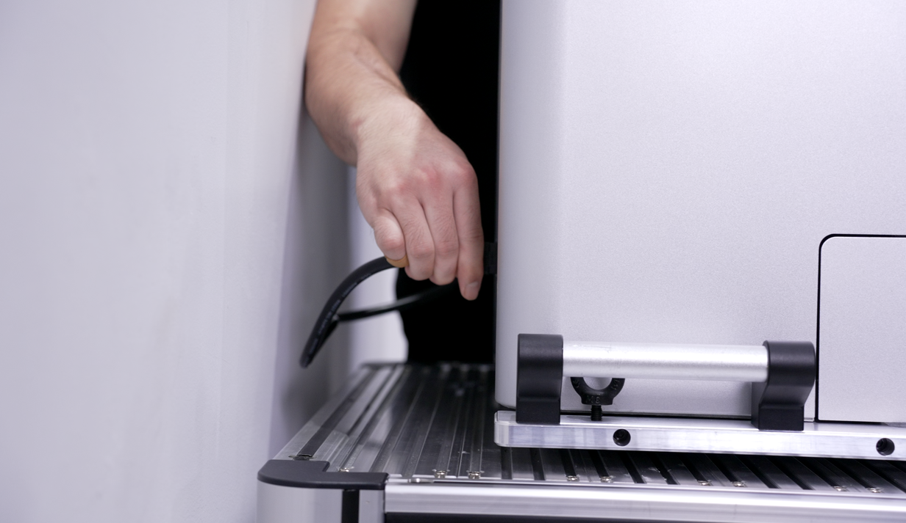
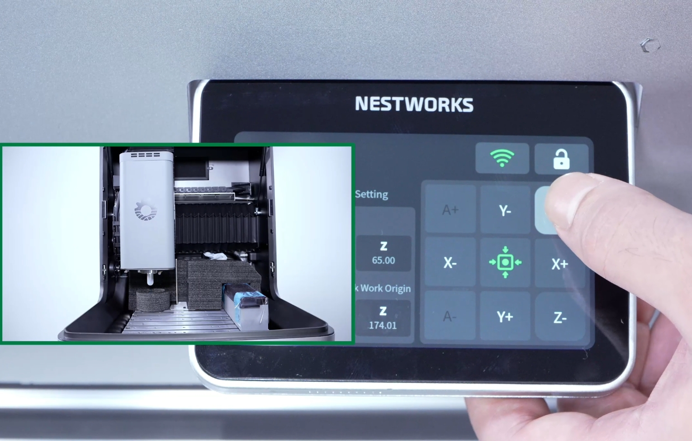

#### Remove the Spindle and Worktable Fixing Bracket

The spindle and worktable fixing bracket prevents the spindle and worktable from shifting or being damaged during transport. Follow the steps below for proper removal. Do not use excessive force, and store all removed screws and components properly.

1. Use a hex key to slowly loosen the spindle fixing screws and worktable fixing screws.

{width=10cm}

2. After the screws are fully loosened, carefully remove the sheet-metal fixing bracket to release the transport lock between the spindle and the worktable.

3. A bag of spindle-side sheet-metal fixing screws is supplied inside the machine. Install the screws into the corresponding sheet-metal mounting holes and tighten them securely.

{width=10cm}

4. Connect the machine to power.

{width=10cm}

5. Use the control system to move the spindle to an appropriate height, then turn off the power.

{width=10cm}

