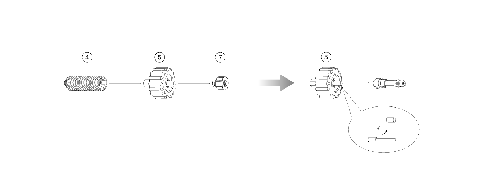

#### Collet Installation and Removal

{width=12cm}

<!-- mdwb:figure id=9e5cbf599a19ebe3 -->
Figure 4-8 Collet Installation and Removal
<!-- /mdwb:figure -->

1. Pull the knurled cap outward to remove it.

2. Unscrew the pin holder and store it properly.

3. Adjust the pin direction according to the collet diameter (the default direction corresponds to M6/M6.35 collets).

4. Insert the knurled cap into the collet and rotate it clockwise in the installation direction to install it (or rotate it counterclockwise to remove it).