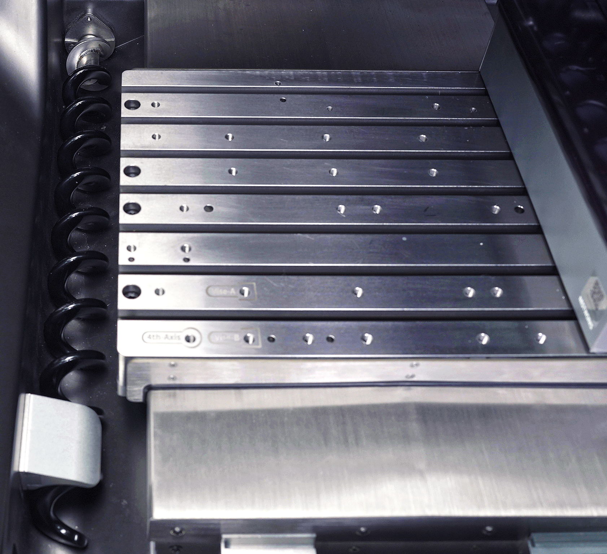

#### Left and Right Chip Auger Installation

{width=12cm}

<!-- mdwb:figure id=cc1d20e83aba6943 -->
Figure 4-11 Left and Right Chip Auger Installation
<!-- /mdwb:figure -->

|No.|Name|
|---|---|
|1|Left chip auger|
|2|Left/right auger flange cover|
|3|Auger flange cover screw|
|4|Left/right auger limit block|
|5|Left/right auger flange plate|

1. Move the Y-axis worktable to the midpoint of the Y-axis, and slide down the left/right auger limit block.
    
2. Use a hex key to remove the auger flange cover screws from the left/right auger flange cover, then remove the left/right auger flange cover.
    
3. Insert the left chip auger into the motor shaft, ensuring that the slot on the shaft end of the left chip auger is aligned with the slot on the left/right auger flange plate.
    
4. Insert the left/right auger flange cover downward from above into the two aligned slots described in Step 3. Use a hex key to tighten the auger flange cover screws to complete the installation of the left chip auger.

{width=12cm}

> [!note] Notice
> 
> The right chip auger can be installed in the same way as the left chip auger. Refer to the steps above to complete the installation.

