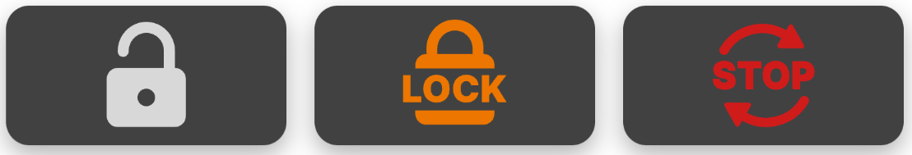
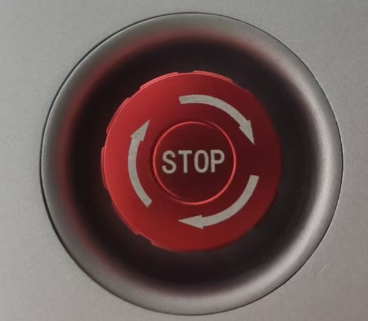
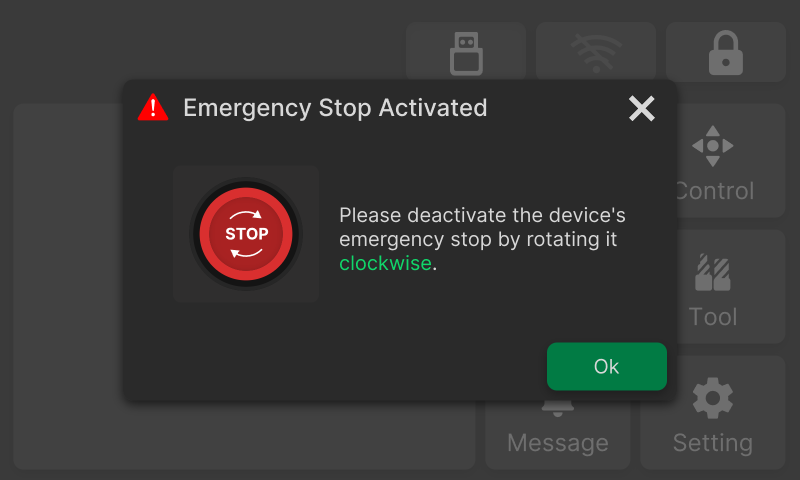

### Header Bar

The NestPad integrates a **Header Bar** at the top, which includes the following functions.

**Table 6-1 Header Bar** <!-- mdwb:table id=5e7bf38ff982900f -->

| Icon                                                                                                                                                              | Item              | Description                                                                                                                                                                                                                                                                                                                                                                                                                                                                                                                                                                                                                                                                                                                                                                                                                                                                                               |
| ----------------------------------------------------------------------------------------------------------------------------------------------------------------- | ----------------- | --------------------------------------------------------------------------------------------------------------------------------------------------------------------------------------------------------------------------------------------------------------------------------------------------------------------------------------------------------------------------------------------------------------------------------------------------------------------------------------------------------------------------------------------------------------------------------------------------------------------------------------------------------------------------------------------------------------------------------------------------------------------------------------------------------------------------------------------------------------------------------------------------------- |
| {width=3cm}                                                                            | **Software Lock** | Software-level safety protection. By default, the device lock button appears as a white unlocked icon. Users can click it to enable the device lock, which disables the spindle and accessory functions. If an abnormal alarm occurs, the machine will also automatically enable the device lock. • **Default**: The button appears as a white unlocked icon. Click to enable the device lock and disable spindle and accessory functions.   • **Locked**: The button appears as an orange **Lock** button, prompting users to click it to unlock the machine.   • **Special**: If the physical E-Stop with the highest control priority is triggered, the button appears as a red **Stop** button. Clicking the button displays the message "Physical E-Stop engaged. Rotate it clockwise to release." After the physical E-Stop is released, click the button to unlock and reset the machine. |
| {width=1cm}{width=2cm} | **E-Stop**        | Emergency safety device for immediately stopping the spindle and motion components in critical situations.                                                                                                                                                                                                                                                                                                                                                                                                                                                                                                                                                                                                                                                                                                                                                                                                |
| {width=3cm}                                                                                     | **Wi-Fi**         | Displays the current network connection status. Click to open the Wi-Fi settings page for quick connection.                                                                                                                                                                                                                                                                                                                                                                                                                                                                                                                                                                                                                                                                                                                                                                                               |
| {width=2cm}                                                                                      | **USB**           | Indicates the status of USB drive connection. Icon lights up when recognized by the system and files can be read. Click to enter the file selection interface.                                                                                                                                                                                                                                                                                                                                                                                                                                                                                                                                                                                                                                                                                                                                            |
| {width=1cm}                                                                                     | **Home**          | Displayed only in secondary and tertiary menus. Click to return to the main page.                                                                                                                                                                                                                                                                                                                                                                                                                                                                                                                                                                                                                                                                                                                                                                                                                         |
| {width=1cm}                                                                                     | **Back**          | Displayed only in secondary and tertiary menus. Click to return to the previous menu or operation interface.                                                                                                                                                                                                                                                                                                                                                                                                                                                                                                                                                                                                                                                                                                                                                                                              |

